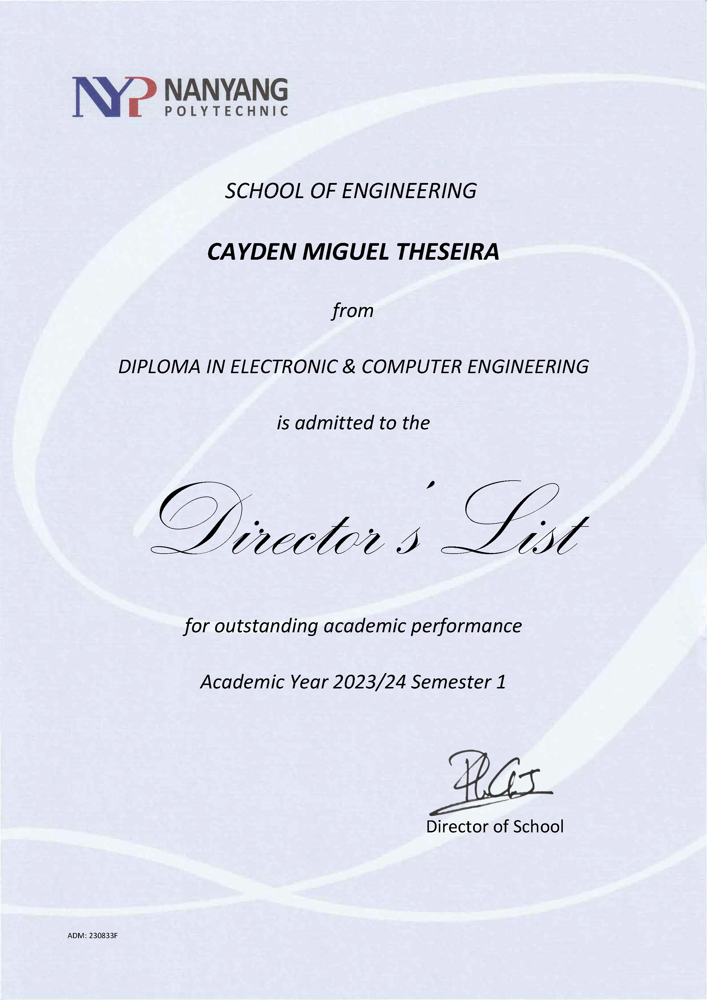
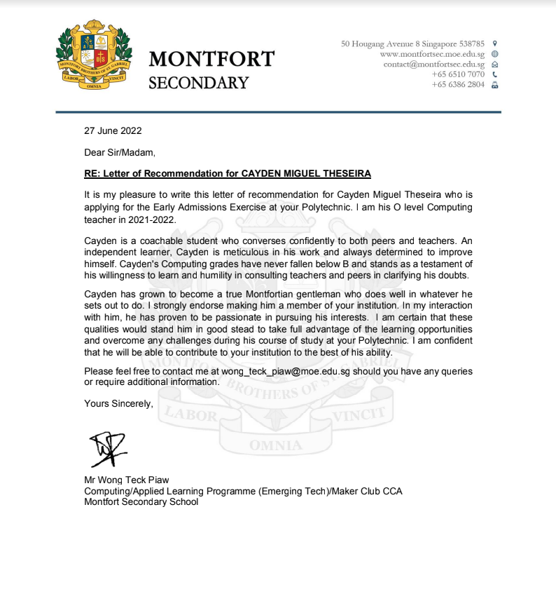
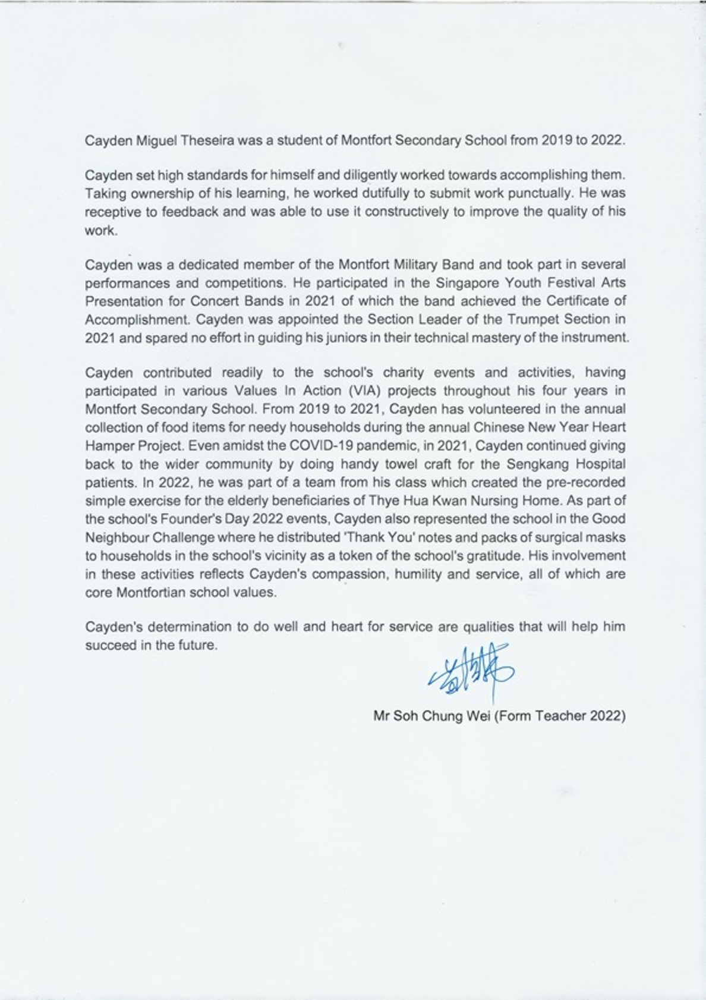
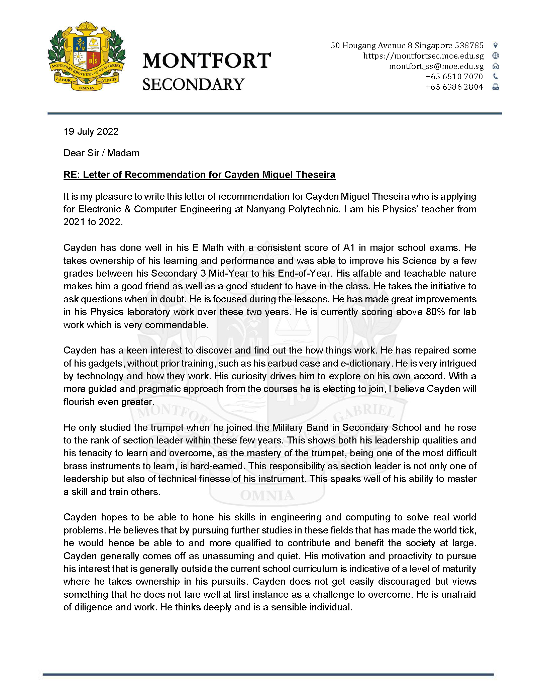
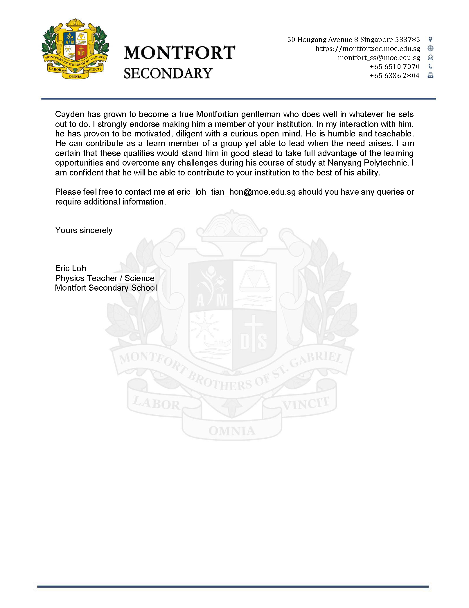

---
# Display name
title: Cayden Miguel Theseira

# Name pronunciation (optional)
# name_pronunciation: Chien Shiung Wu

# Full name (for SEO)
first_name: Cayden
last_name: Theseira

# Status emoji
status:
  icon: ☕️

# Is this the primary user of the site?
superuser: true

# Highlight the author in author lists? (true/false)
highlight_name: true

# Role/position/tagline
# role: Chief Scientist

# Organizations/Affiliations to display in Biography blox
# organizations:
#   - name: OpenAI
#     url: https://openai.com/

# Social network links
# Need to use another icon? Simply download the SVG icon to your `assets/media/icons/` folder.
profiles:
  - icon: at-symbol
    url: 'mailto:caydenmtheseira@outlook.com'
    label: E-mail Me
  # - icon: brands/x
  #   url: https://twitter.com/GetResearchDev
  # - icon: brands/instagram
  #   url: https://www.instagram.com/
  - icon: brands/github
    url: https://github.com/Cayden2606
  - icon: brands/linkedin
    url: https://www.linkedin.com/in/cayden-theseira-48235233a/
  # - icon: academicons/google-scholar
  #   url: https://scholar.google.com/
  # - icon: academicons/orcid
  #   url: https://orcid.org/

interests:
  - Artificial Intelligence
  - Internet Of Things
  - Application Programming

education:
  - area: Diploma in Electronic and Computer Enginnering
    institution: Nanyang Polytechnic
    date_start: 2023-04-01
    date_end: 2024-03-01
    summary: |
      - Cumulative GPA: 3.99
      - Director’s List for 3 consecutive semesters
      - Edusave Bursary Award: 2024
      - Specialised in Computer Engineering
      - Student Mentor
    # button:
    #   text: 'Read Thesis'
    #   url: 'https://example.com'
  - area: GCE O-Level
    institution: Montfort Secondary School
    date_start: 2019-01-01
    date_end: 2022-11-30
    summary: |
      - GCE ‘O’ Levels: Net L1R4 – 12
      - Edusave Good Progress Award: 2019
      - Edusave Bursary Award: 2022
  # - area: BSc Artificial Intelligence
  #   institution: Massachusetts Institute of Technology
  #   date_start: 2016-01-01
  #   date_end: 2020-12-31
  #   summary: |
  #     GPA: 3.4/4.0
      
  #     Courses included:
  #     - lorem ipsum dolor sit amet, consectetur adipiscing elit
  #     - lorem ipsum dolor sit amet, consectetur adipiscing elit
  #     - lorem ipsum dolor sit amet, consectetur adipiscing elit
work:
  - position: Computer Engineer Intern
    company_name: Micron Technology®
    company_url: 'https://sg.micron.com/'
    company_logo: 'https://scontent.fsin16-1.fna.fbcdn.net/v/t39.30808-1/462593766_1057475599713657_6028837455313199_n.jpg?stp=cp6_dst-jpg_s720x720_tt6&_nc_cat=102&ccb=1-7&_nc_sid=f4b9fd&_nc_ohc=w0535QuNLvgQ7kNvgEhafmr&_nc_zt=24&_nc_ht=scontent.fsin16-1.fna&_nc_gid=AL5QZiJ6lahlPXSCrSzZgqt&oh=00_AYD06EWbPGfYtUMnELMNE2EiUDqrQ1y9-HWWo8ywSzKfKw&oe=67659452'
    date_start: 2025-03-01
    date_end: 2025-08-31
    summary: |2-
      Responsibilities include:
        - Assisted in the development and testing of memory solutions for embedded systems
        - Designed automated scripts in Python to streamline performance diagnostics for NAND products
        - Gained hands-on experience with PCB testing tools and debugging technique
  # - position: Backend Software Engineer
  #   company_name: X
  #   company_url: ''
  #   company_logo: ''
  #   date_start: 2016-01-01
  #   date_end: 2020-12-31
  #   summary: |
  #     Responsibilities include:
  #     - Migrated infrastructure to a new data center
  #     - lorem ipsum dolor sit amet, consectetur adipiscing elit
  #     - lorem ipsum dolor sit amet, consectetur adipiscing elit

# Skills
# Add your own SVG icons to `assets/media/icons/`
skills:
  - name: Technical Skills
    items:
skills:
  - name: Technical Skills
    items:
      - name: Python
        description: ''
        percent: 90
        icon: "custom/py"
      - name: JavaScript
        description: ''
        percent: 60
        icon: "custom/js"
      - name: HTML/CSS
        description: ''
        percent: 85
        icon: "custom/html"
      - name: C#
        description: ''
        percent: 75
        icon: "custom/CS"
      - name: PCB Design (Autodesk Eagle)
        description: ''
        percent: 60
        icon: "custom/eagle"
      - name: SQL
        description: ''
        percent: 40
        icon: circle-stack
  - name: Hobbies
    color: '#eeac02'
    color_border: '#f0bf23'
    items:
      - name: Computers
        description: ''
        percent: 100
        icon: "custom/computer"
      - name: Cats
        description: ''
        percent: 100
        icon: cat
      - name: Photography
        description: ''
        percent: 80
        icon: camera
      - name: Gaming
        description: ''
        percent: 60
        icon: "custom/gaming"
      - name: Reading
        description: ''
        percent: 40
        icon: "custom/book"
      - name: Drawing
        description: ''
        percent: 80
        icon: "custom/drawing"

languages:
  - name: English
    percent: 100
  - name: Chinese
    percent: 75

# Awards.
#   Add/remove as many awards below as you like.
#   Only `title`, `awarder`, and `date` are required.
#   Begin multi-line `summary` with YAML's `|` or `|2-` multi-line prefix and indent 2 spaces below.
# awards:
  # - title: Neural Networks and Deep Learning
  #   url: https://www.coursera.org/learn/neural-networks-deep-learning
  #   date: '2023-11-25'
  #   awarder: Coursera
  #   icon: coursera
  #   summary: |
  #     I studied the foundational concept of neural networks and deep learning. By the end, I was familiar with the significant technological trends driving the rise of deep learning; build, train, and apply fully connected deep neural networks; implement efficient (vectorized) neural networks; identify key parameters in a neural network’s architecture; and apply deep learning to your own applications.
  # - title: Blockchain Fundamentals
  #   url: https://www.edx.org/professional-certificate/uc-berkeleyx-blockchain-fundamentals
  #   date: '2023-07-01'
  #   awarder: edX
  #   icon: edx
  #   summary: |
  #     Learned:
  #     - Synthesize your own blockchain solutions
  #     - Gain an in-depth understanding of the specific mechanics of Bitcoin
  #     - Understand Bitcoin’s real-life applications and learn how to attack and destroy Bitcoin, Ethereum, smart contracts and Dapps, and alternatives to Bitcoin’s Proof-of-Work consensus algorithm
  # - title: 'Object-Oriented Programming in R'
  #   url: https://www.datacamp.com/courses/object-oriented-programming-with-s3-and-r6-in-r
  #   certificate_url: https://www.datacamp.com
  #   date: '2023-01-21'
  #   awarder: datacamp
  #   icon: datacamp
  #   summary: |
  #     Object-oriented programming (OOP) lets you specify relationships between functions and the objects that they can act on, helping you manage complexity in your code. This is an intermediate level course, providing an introduction to OOP, using the S3 and R6 systems. S3 is a great day-to-day R programming tool that simplifies some of the functions that you write. R6 is especially useful for industry-specific analyses, working with web APIs, and building GUIs.
---
<!-- 

  
Awards

  

    

      
      
Edusave Good Progress Award 2019

    

    

      
      
Edusave Merit Bursary 2022

    

    

      
      
Edusave Merit Bursary 2024

    

    

      
      
Director's List Semester 1

    

    

      
      
Director's List Semester 2

    

  

  
Testimonial

  

    

      
      
Mr. Wong Teck Piaw, Computing Teacher

    

    

      
      
Mr. Soh Chung Wei, Form Teacher 2022

    

    

      
      
Mr. Eric Loh, Physics Teacher (Page 1)

    

        

      
      
Mr. Eric Loh, Physics Teacher (Page 2)

    

  

 -->

## About Me

Cayden Theseira is a fresh graduate from Nanyang Polytechnic, holding a diploma in Electronic and Computer Engineering. With a strong passion for software development and a focus on computer engineering, Cayden's interests span IoT applications, user experience design, and innovative solutions for sustainability.
<!-- 
He has contributed to projects like ASS (Automatic Shutting System), an award-winning modular attachment for refrigeration doors that enhances energy efficiency, and the IoT Smart Bus Stop, a sustainable prototype with smart features. Additionally, he developed a Morse Code Translator, showcasing his ability to integrate software and hardware for practical applications. -->
