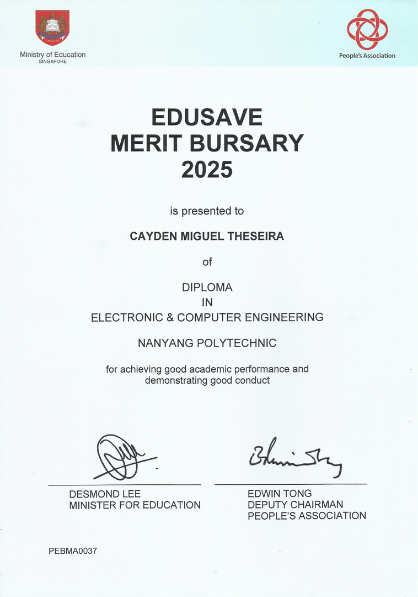
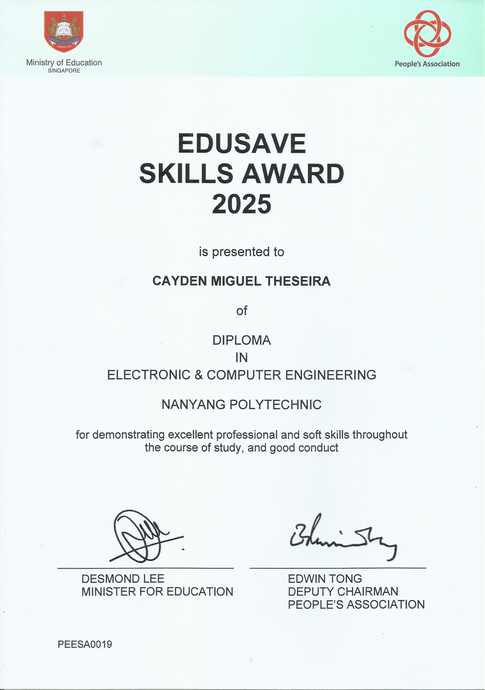
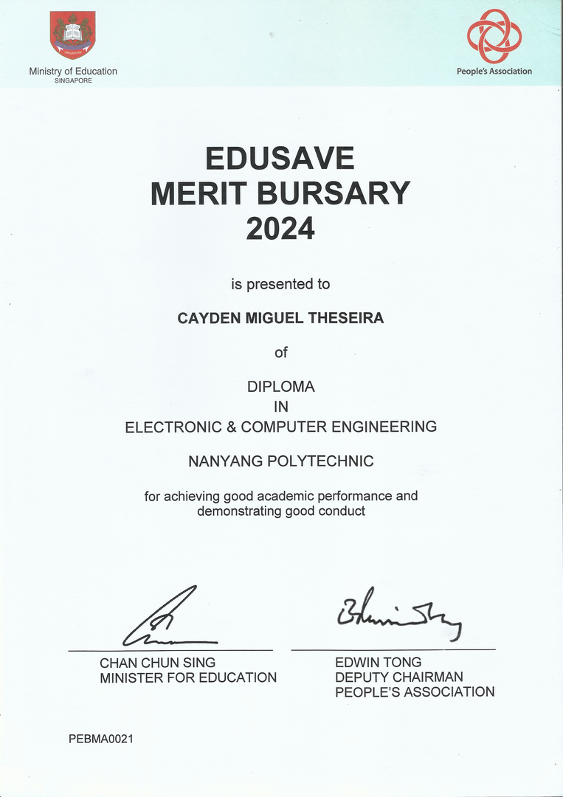
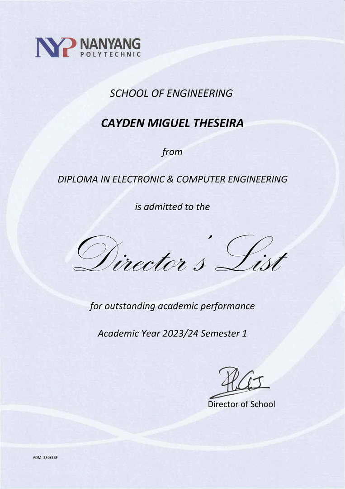
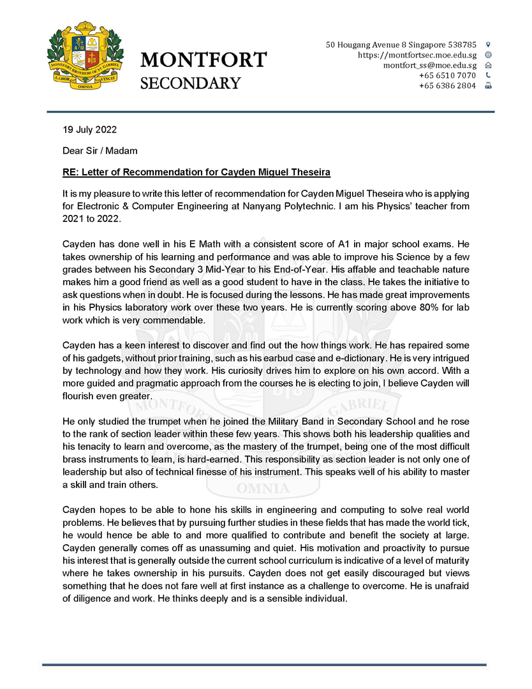

  
Awards

  

    

      
      
Edusave Merit Bursary 2025

    

    

      
      
Edusave Skills Award 2025

    

    

      
      
Director's List Year 2 Semester 2

    

    

      
      
Director's List Year 2 Semester 1

    

    

      
      
Edusave Merit Bursary 2024

    

    

      
      
Director's List Year 1 Semester 2

    

    

      
      
Director's List Year 1 Semester 1

    

    

      
      
Edusave Merit Bursary 2022

    

    

      
      
Edusave Good Progress Award 2019

    

  

 

  
Testimonial

  

    

      
      
Mr. Wong Teck Piaw, Computing Teacher

    

    

      
      
Mr. Soh Chung Wei, Form Teacher 2022

    

    

      
      
Mr. Eric Loh, Physics Teacher (Page 1)

    

    

      
      
Mr. Eric Loh, Physics Teacher (Page 2)

    

  

<!-- Lightbox (inline CSS only) -->

  
  
×

