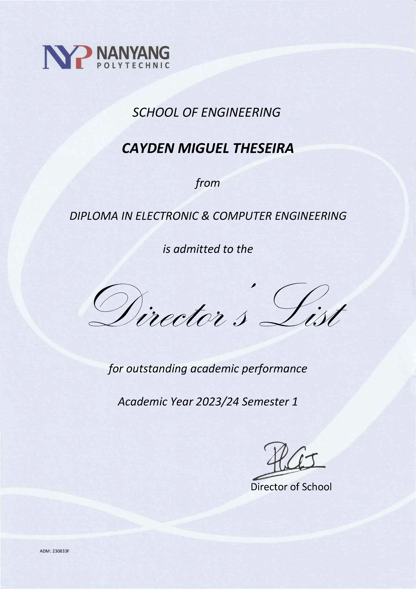
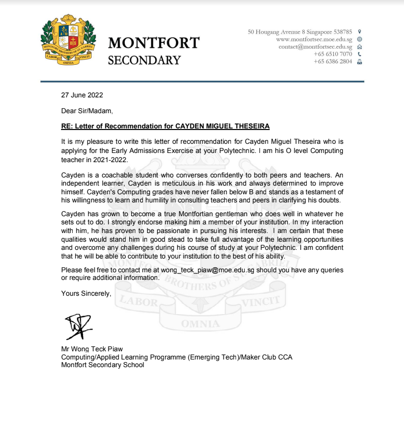
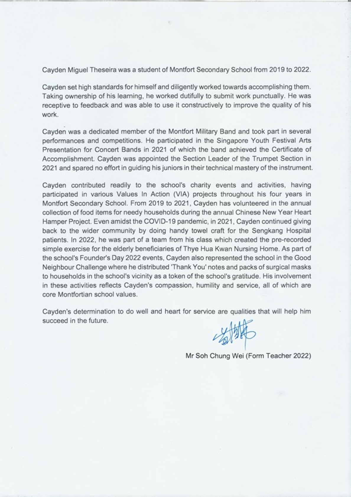
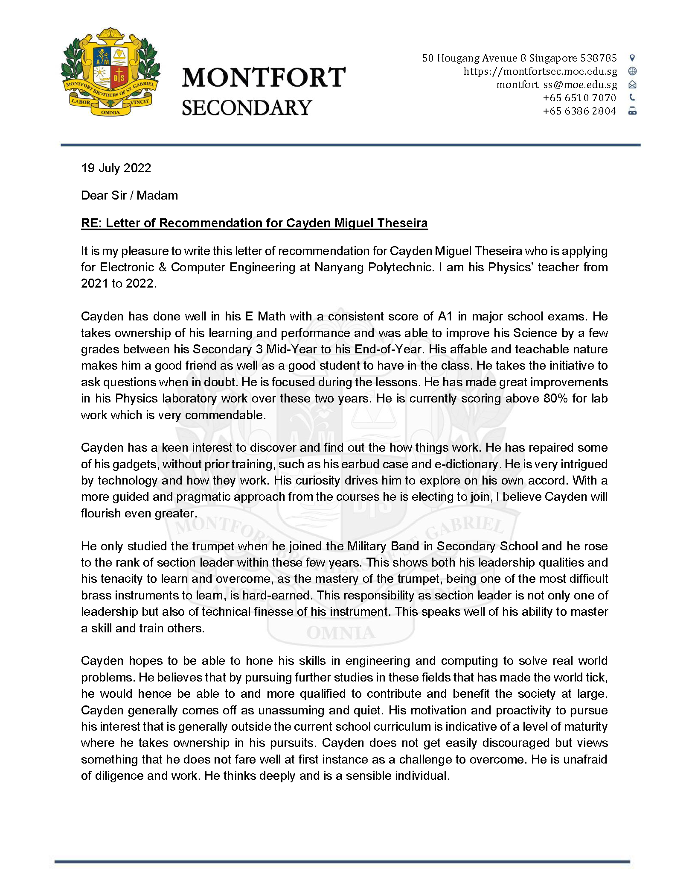
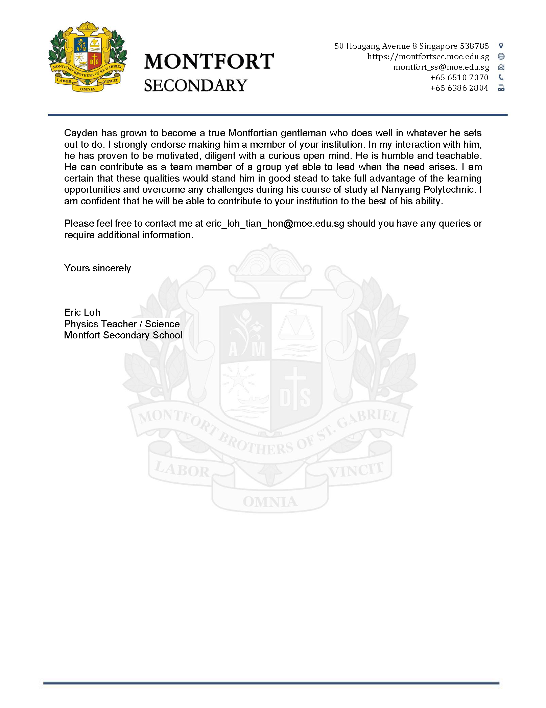

  
Awards

  

    

      
      
Edusave Good Progress Award 2019

    

    

      
      
Edusave Merit Bursary 2022

    

    

      
      
Edusave Merit Bursary 2024

    

    

      
      
Director's List Semester 1

    

    

      
      
Director's List Semester 2

    

  

  
Testimonial

  

    

      
      
Mr. Wong Teck Piaw, Computing Teacher

    

    

      
      
Mr. Soh Chung Wei, Form Teacher 2022

    

    

      
      
Mr. Eric Loh, Physics Teacher (Page 1)

    

        

      
      
Mr. Eric Loh, Physics Teacher (Page 2)

    

  

