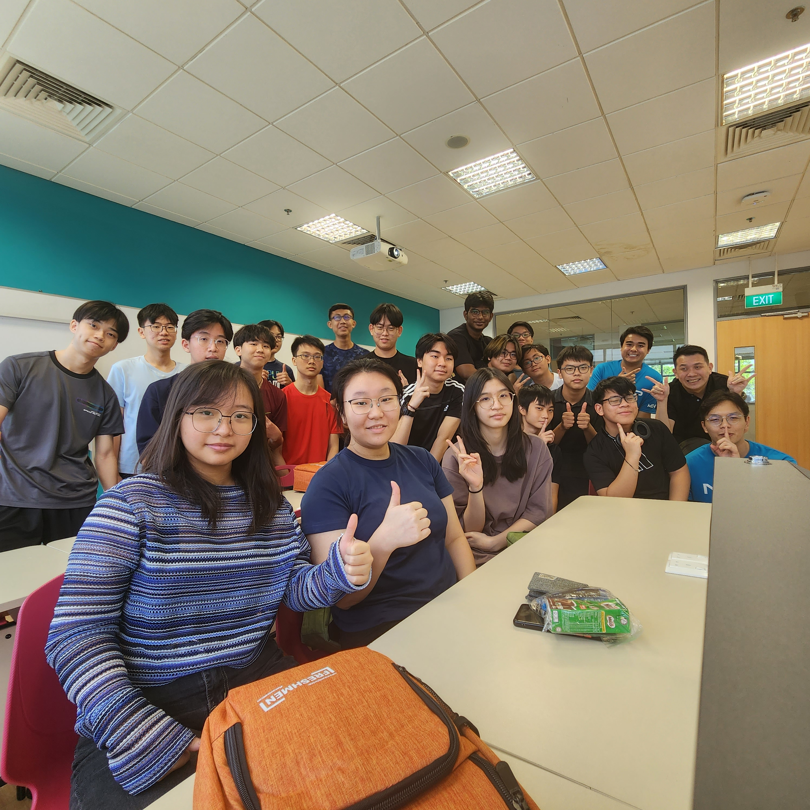
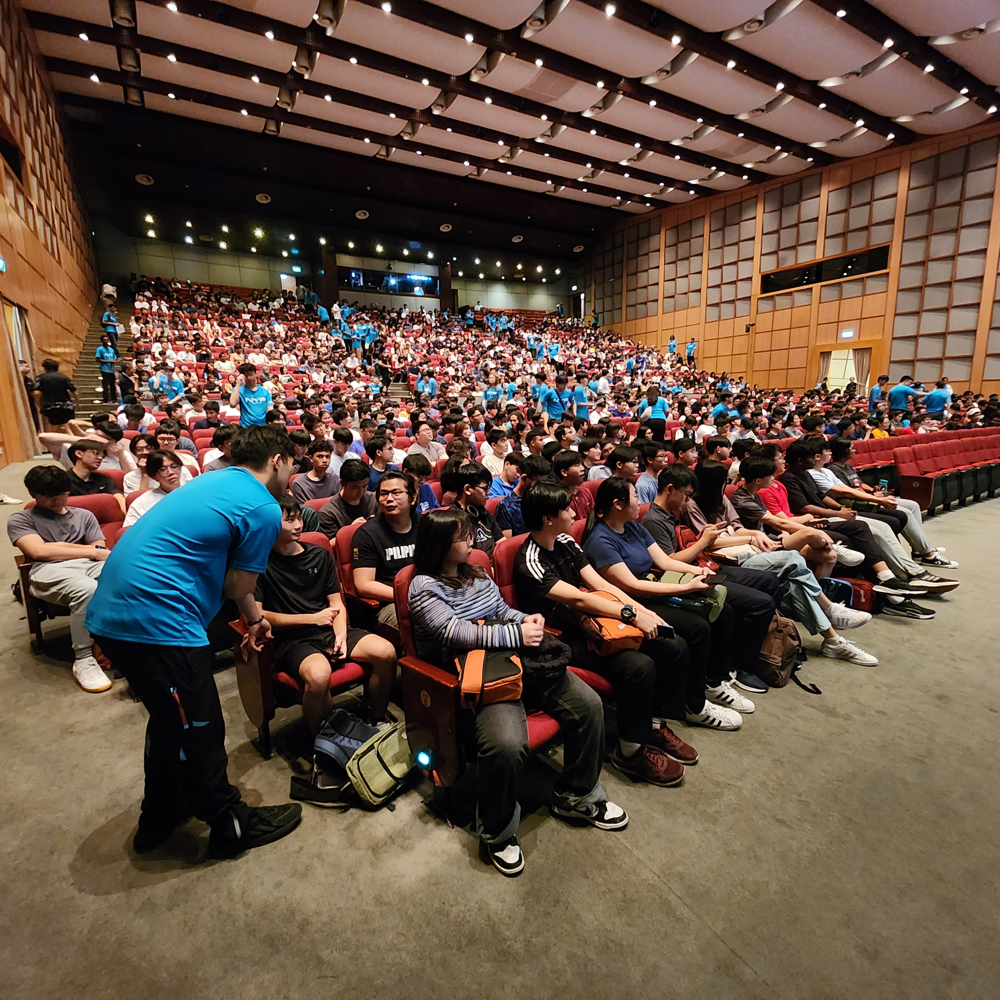
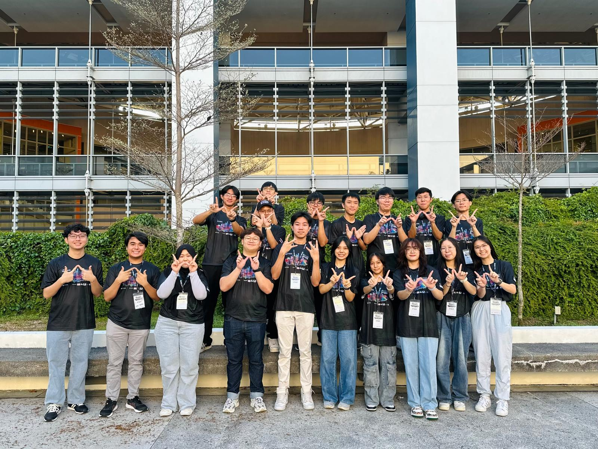
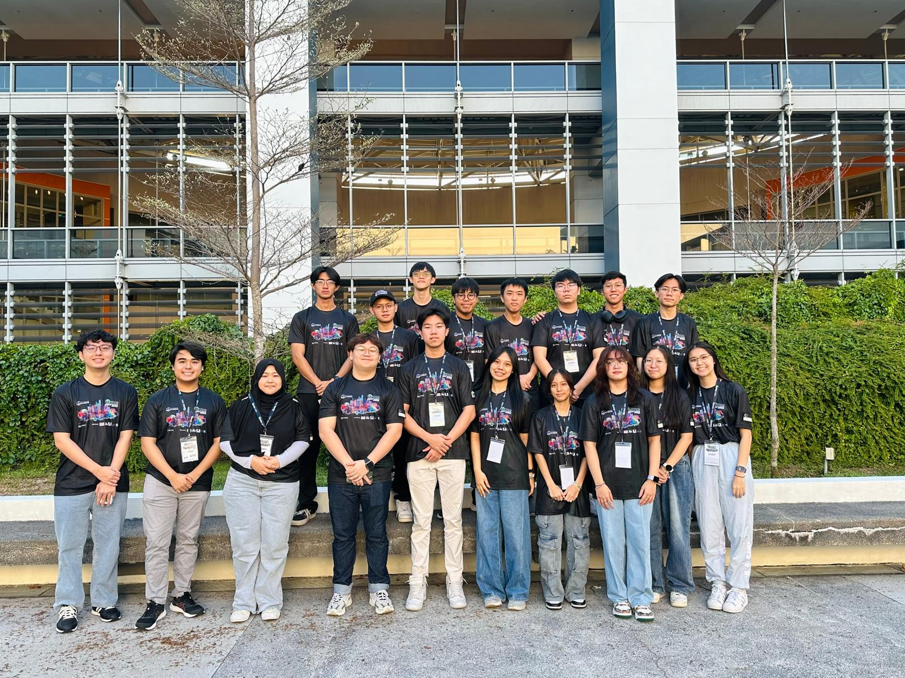

<h3>Student Mentor Programme (NYP) 2024</h3>

- Mentored a class of 20 incoming students, providing personalized guidance on academic and extracurricular pursuits to help them transition smoothly into the campus environment.
- Assisted in organizing and leading campus tours during the Freshmen Orientation (FMO), introducing students to key facilities and resources while fostering a sense of belonging.
- Acted as a first point of contact for students, answering questions, addressing concerns, and creating a supportive community within the group.
- Promoted team-building and collaboration through icebreaker activities and group discussions.
- Shared insights on effective time management, study strategies, and leveraging campus resources to maximize their academic and personal growth.
 

    

      
      
Student Mentor 2024

    

    

      
      
Stduent Mentor 2024

    

<h3>World Robot Games (WRG) 2024</h3>

- Tour Guide: Led a tour for over 20 international participants, primarily students, showcasing the engineering block, campus facilities, and student projects. Fostered engagement by answering questions and highlighting innovative initiatives while enhancing intercultural communication skills.
- Game Referee: Managed and officiated various competition events, ensuring strict adherence to rules and maintaining fairness. Collaborated with organizers and participants to resolve disputes effectively, demonstrating leadership and impartiality.
 

    

      
      
WRG Volunteers 2024

    

    

      
      
WRG Volunteers 2024

    

