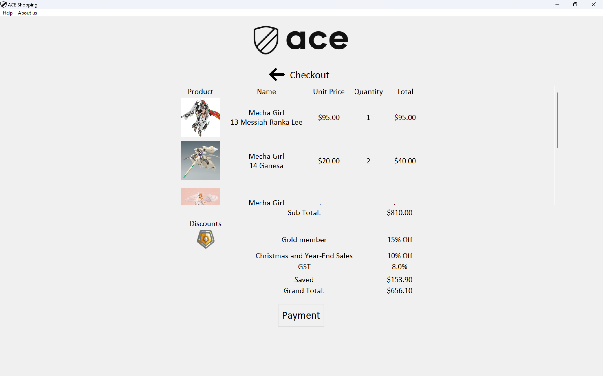



<a href="https://github.com/Cayden2606/ACE-Shopping" style="display: flex; align-items: center;" target="_blank">
  
  GitHub Repository for ACE Shopping
</a>


## Overview
The ACE Shopping program simulates an online shopping platform designed to provide a rich, interactive, and user-friendly experience. By mimicking key e-commerce functionalities, this project enables users to browse products, manage a shopping cart, and enjoy engaging features like discounts and a fun "Lucky Spin" game.

## Screenshots
<hr>

### Homepage


### Cart  


### Sorting Options


### Lucky Spin Feature 


### Payment Page


---

## **Key Features**
### **Core Functionalities**  
- **Product Categories and Items**: Browse through product categories and explore available options.  
- **Shopping Cart Management**: Seamlessly add, remove, and view items in the cart.  
- **Discount Options**: Access and apply available discounts for savings.  
- **Lucky Spin Feature**: A fun gambling-style feature to win extra discounts.  
- **Search Functionality**: Find items quickly by name or unique ID.

### **Additional Enhancements**
- **Event-Themed Discounts**: Seasonal or promotional offers for a dynamic shopping experience.  
- **Sorting Options**: Organize products by categories or prices for easier browsing.  
- **Custom Visuals**: GUI enhanced with custom images for buttons and product visuals using the Python Imaging Library (PIL).

---

## **Major Deliverables**
- **Intuitive GUI**: User-friendly interface built using Tkinter.  
- **Advanced Shopping Cart**: Tools to manage items effectively.  
- **Exciting Lucky Spin**: Adds a unique interactive feature to the platform.  
- **Search Bar**: Quickly locate products by name or ID.  
- **Transparent Discounts**: Clear and user-friendly display and application of discounts.

---

## **Implementation Details**
- **Framework**: Developed with Python and the Tkinter library for GUI design.  
- **GUI Structure**:
  - Organized with frames to separate sections for:
    - Product categories
    - Shopping cart
    - Discount options  
  - Buttons, labels, and images for an engaging user interface.  
- **Custom Visuals**:
  - Integrated custom product images using the Python Imaging Library (PIL).  
- **Core Functionalities**:
  - Adding items to the cart.
  - Displaying and applying discounts.
  - Searching for specific items.
  - Sorting and organizing products.  

---

## **Special Features**
- **Polished GUI**: Clean and intuitive interface designed with Tkinter.  
- **Lucky Spin Game**: A unique and engaging feature for discount opportunities.  
- **Powerful Search**: Find products quickly using names or IDs.  
- **Event-Themed Discounts**: Custom offers tied to seasons or events.  
- **Enhanced Sorting**: Organize items for a smooth shopping experience.  

---

## **How to Run**
1. Clone the repository:
   ```bash
   git clone https://github.com/your-username/ace-shopping.git
   ```
2. Navigate to the project directory:
   ```bash
   cd ace-shopping
   ```
3. Install dependencies (if any):
   ```bash
   pip install pillow
   ```
4. Run the application:
   ```bash
   python ace_shopping.py
   ```

---