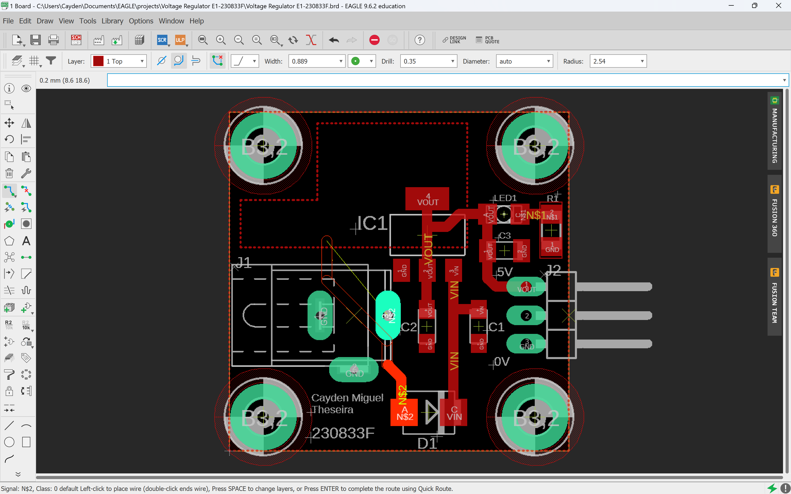
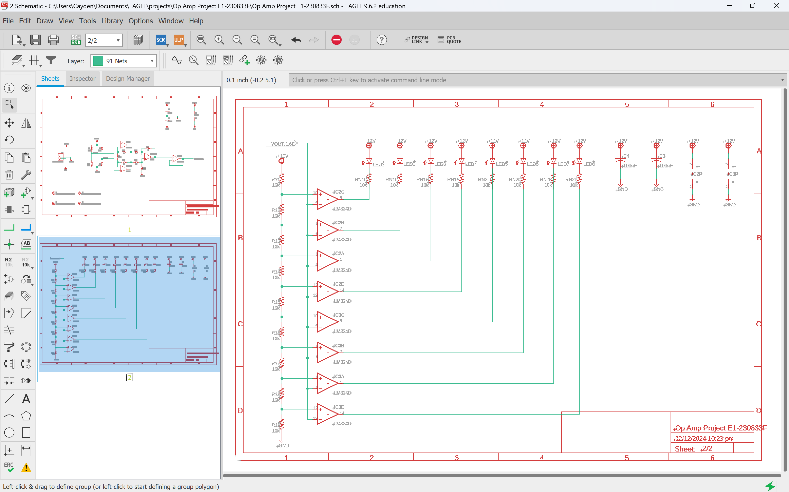
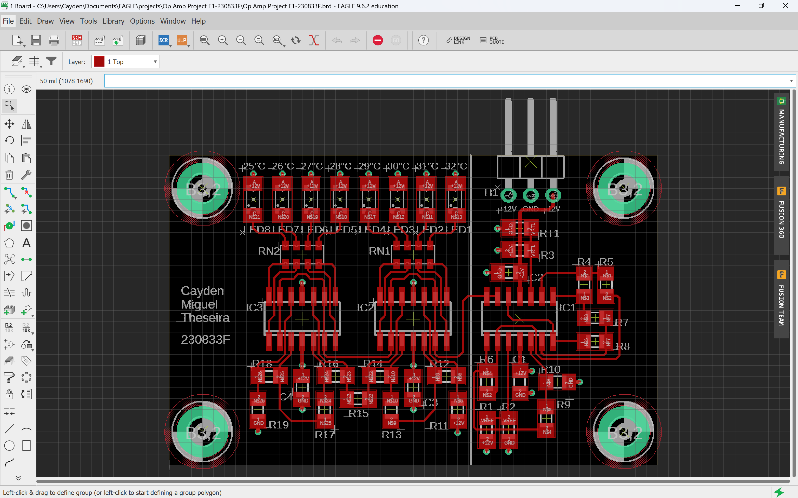
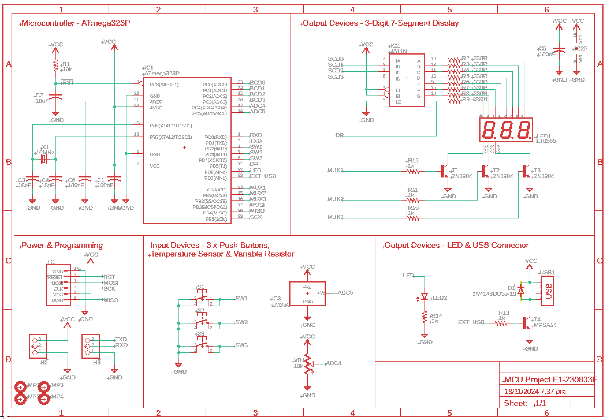
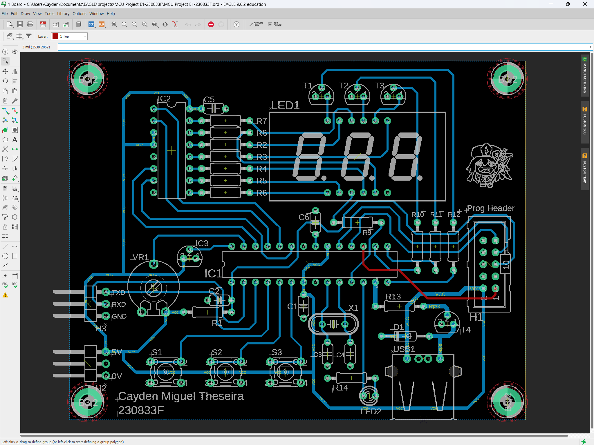



## Overview
This project highlights the design and implementation of a **4-layer printed circuit board (PCB)** using **Eagle Autodesk** software. The PCB features carefully routed traces, components, and a clean schematic layout, showcasing both the functional design and aesthetic organization of a complex electronics project.

## Key Features
- **4-Layer Board:** Ensures efficient signal routing, improved noise management, and compact design.
- **Eagle Autodesk:** Industry-standard software used for both schematic design and PCB layout.
- **Component Integration:** Incorporates LEDs, ICs, capacitors, resistors, and other components for system functionality.
- **Custom Traces:** Meticulously routed connections to optimize signal flow and performance.
- **Functional Layout:** Combines power delivery, signal transmission, and programmable headers for flexibility.

## Tools and Software
- **Eagle Autodesk**: Used for schematic capture and PCB layout.
- **Soldering and Assembly Tools**: For populating and testing the physical board.

## The Design Process
1. **Schematic Design**: The logical connections between components were drawn and verified.
2. **Component Placement**: Components were positioned for minimal trace lengths and optimal performance.
3. **Layer Routing**: 
   - Top and bottom layers for signal traces.
   - Inner layers for power and ground planes.
4. **DRC (Design Rule Check)**: Ensured no errors in trace widths, clearances, and placements.

## Board Highlights
The image below displays the completed PCB layout:
- **Multiple Components**: Including ICs, voltage regulators, and a 7-segment display.
- **Headers**: Programming and input/output headers for external connections.
- **Power Distribution**: Separate planes for VCC and GND to reduce noise.
- **Silkscreen**: Annotated with component labels for easier debugging and assembly.

## Op Amp Circuit
This section features the op-amp circuit design with both its schematic and board layout. The op-amp circuit is integral for signal amplification and conditioning in this project.

### Schematic

### Board Layout

## MCU Integration
The microcontroller unit (MCU) is the brain of the system, responsible for processing inputs and controlling outputs. This section showcases the MCU design.

### Schematic

### Board Layout

## Challenges and Solutions
- **Trace Routing Complexity**: Solved by utilizing 4 layers to isolate signals and reduce interference.
- **Component Placement**: Carefully organized to balance performance and aesthetics.
- **Layer Optimization**: Inner layers dedicated to power and ground helped minimize noise and improve efficiency.

## Conclusion
This project demonstrates my expertise in PCB design using Eagle Autodesk. By combining technical precision with a clean layout, I achieved a functional and professional 4-layer PCB. The board is ready for testing and further integration into larger systems.

---