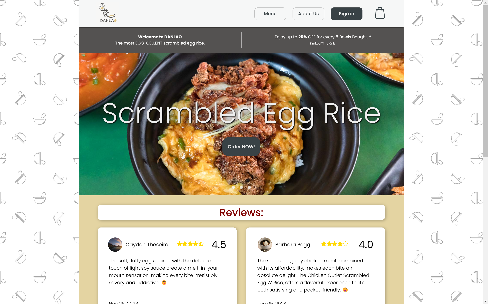
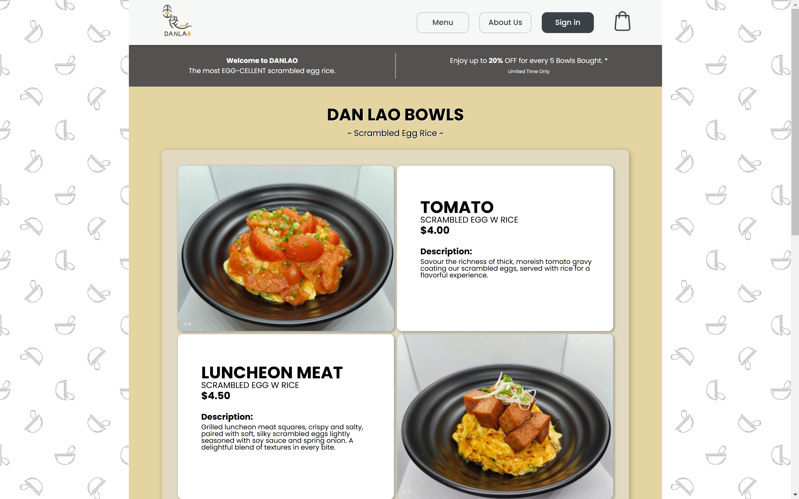
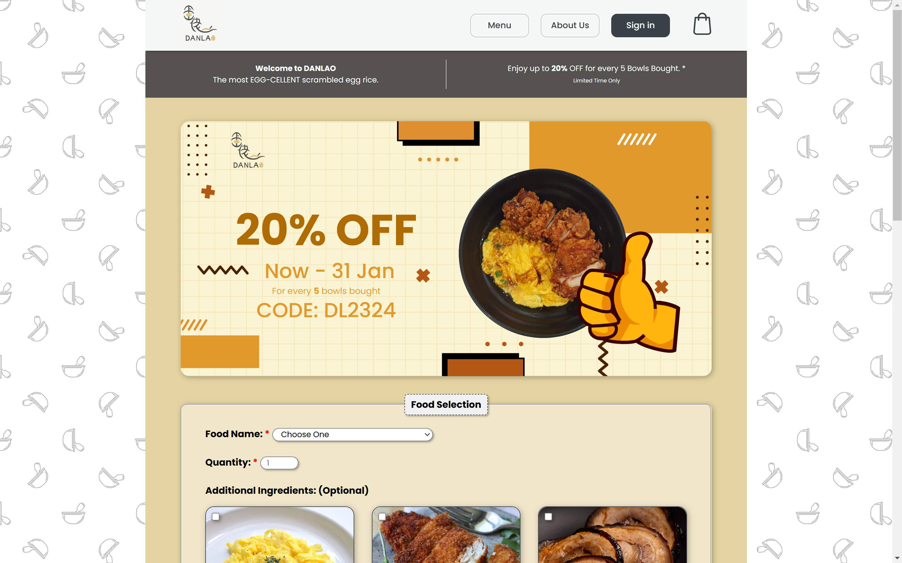



<a href="https://github.com/Cayden2606/ScrambledEggRice-Website-Mockup" style="display: flex; align-items: center;" target="_blank">
  
  GitHub Repository for Scrambled Egg Rice Website Mockup 🍳🍚
</a>

---

## Overview

The Scrambled Egg Rice  website mockup replicates a smooth online food ordering experience. It includes user-friendly navigation, product menus, ordering forms, and registration options. This project emphasizes responsive design and clean visuals to deliver a delightful browsing experience.

---

## Pages Preview

### Homepage  


### Menu Page  


### About Us Page  


### Order Page  


### Video Demostration
<div style="text-align: center;">
  <video autoplay loop muted style="max-width: 100%; height: auto;">
    <source src="Site.mp4" type="video/mp4">
    Your browser does not support the video tag.
  </video>
  <div style="font-size: small; margin-top: -10px;">Scrambled Egg Rice Website Mockup 🍳🍚</div>
</div>

---

## Features

- **Homepage**: Promotional banners, special offers, and customer reviews.
- **Menu Page**: A list of food options with descriptions and pricing.
- **Order Page**: Detailed order form to customize food selections, add-ons, and delivery preferences.
- **About Us**: A brief introduction to Scrambled Egg Rice, location details, and contact information.
- **Sign-in Page**: User registration form with validation for secure inputs.

---

## Technologies Used

- **HTML5**: For creating the structure of the website.
- **CSS3**: Styling with responsive design.
- **Google Fonts**: "Poppins" font for clean typography.
- **External Form Handler**: [jkorpela.fi](https://jkorpela.fi/cgi-bin/echo.cgi) for form submission testing.
- **Images**: Custom food images and icons.

---

## Pages

1. **Home Page** (`index.html`)  
   - Welcomes visitors with a promotion banner and featured reviews.  
   - Includes a call-to-action for menu and ordering.  

2. **Menu Page** (`menu.html`)  
   - Displays all available scrambled egg rice bowls with images, descriptions, and prices.

3. **Order Page** (`order.html`)  
   - Allows customers to select food items, customize add-ons, and enter delivery details.

4. **About Us Page** (`about-us.html`)  
   - Shares Scrambled Egg Rice's story, location information (integrated Google Maps), and contact options.

5. **Sign-in Page** (`sign-in.html`)  
   - A registration form for new users with input validation.

---

## How to Run

1. Clone the repository:
   ```bash
   git clone https://github.com/yourusername/scrambled-egg-rice-website.git
   cd scrambled-egg-rice-website
   ```

2. Open `index.html` in any modern browser to start exploring.

3. For order form testing, submit forms to the included [echo server](https://jkorpela.fi/cgi-bin/echo.cgi) for mock responses.

---

## Future Enhancements

- Add **JavaScript** for form validation and interactivity.
- Implement a backend for order processing and user authentication.
- Include a database for storing user data and orders.
- Improve **mobile responsiveness** for smaller screens.

---


Enjoy the **EGG-CELLENT** experience! 🥚✨

---