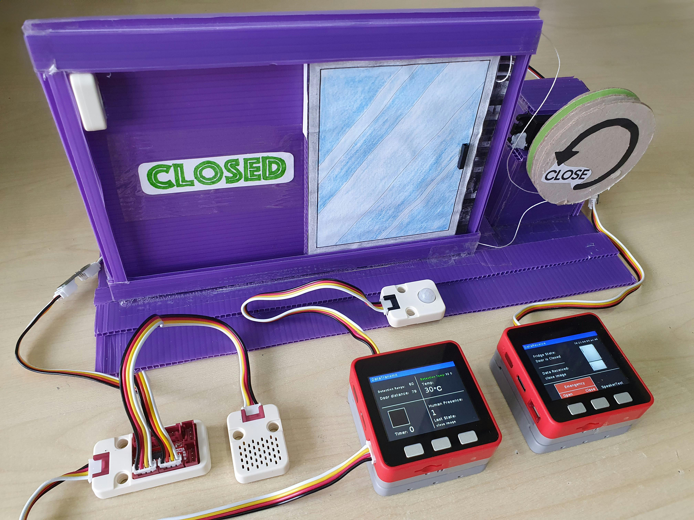
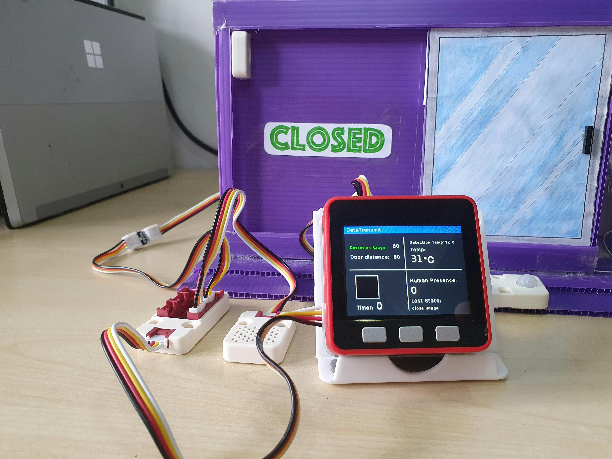
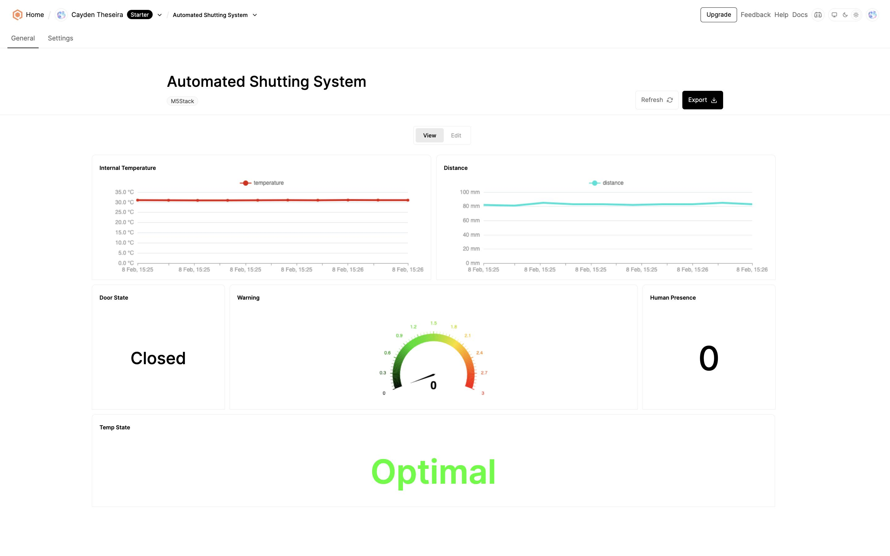
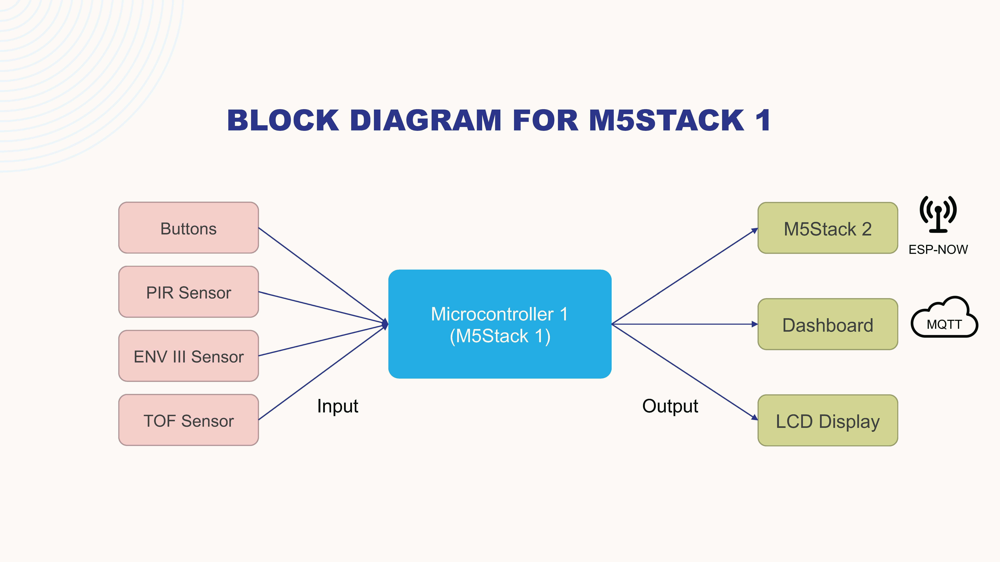
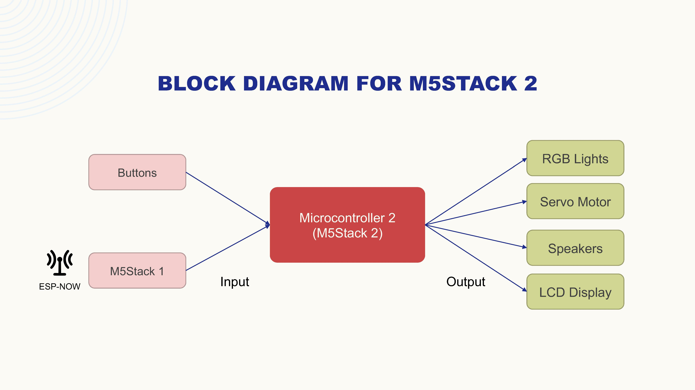
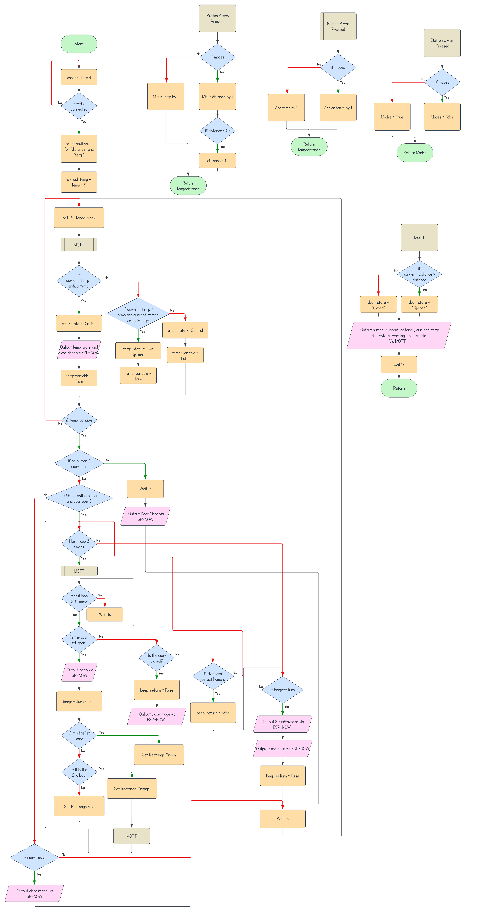
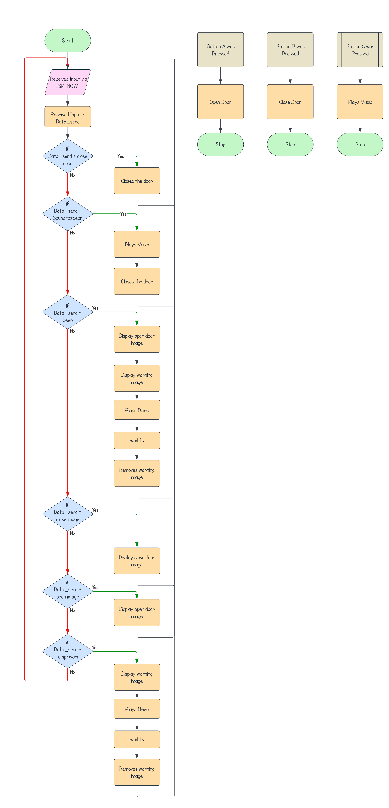


<!-- 

 -->
<a href="https://www.hackster.io/515083/automatic-shutting-system-66b8ab" style="display: flex; align-items: center;" target="_blank">
  
  Hackster.io
</a>
<a href="https://www.linkedin.com/posts/m5stack_projectspotlight-tof-pir-activity-7255070732387254273-CgfR/?utm_source=share&utm_medium=member_desktop" style="display: flex; align-items: center;" target="_blank">
  
  M5Stack LinkedIn Recognition to A.S.S
</a>

<!-- ### Story

Supermarket fridges consume enough electricity to power 800, 000 homes. A study by the Department of Environment, Food, and Rural Affairs found that the entire retail food sector uses around 3% of the UK's annual energy output. Refrigeration accounts for 50-60% of the electricity consumed in a supermarket. In food and grocery stores, refrigeration is the largest consumer of energy, operating non-stop and responsible for around half of the store’s total energy consumption.

This project aims to address the significant energy consumption of refrigerators and freezers in supermarkets by targeting the forgetfulness of shoppers who leave the doors open or take too long to close them, ultimately promoting environmental sustainability.

### Objectives

- To develop a solution to reduce the power consumption of refrigerators and freezers in retail, supermarkets.
- Able to be modular to fit onto existing refrigeration units without requiring extensive modifications, minimising installation time and cost.

### Research

- Supermarket refrigeration is a major contributor to overall energy usage, and reducing its consumption can significantly impact energy efficiency.
- Understanding why shoppers leave fridge and freezer doors open can help design effective solutions to address this behaviour.
- Implementing sensors to detect door status and temperature can provide real-time data to optimise energy usage.

### Project

- Door Detection System - Utilising a TOF sensor to detect if a refrigerator or freezer door is left open and initiating alerts accordingly.
- Human Presence detector - Using a PIR sensor to sense if anyone is at the refrigerator door.
- Automated Door Closure - Automatically closing doors if left open for an extended period to conserve energy.
- User Interface - Providing visual and auditory alerts to shoppers to prompt them to close doors promptly.
- Real-time Monitoring - Continuous monitoring of internal temperature ENV III and door status on the dashboard via Qbitro to ensure optimal conditions

### Video Demonstration 


### Poster
<iframe src="EEPY_A2.pdf" width="100%" height="500px" style="border: none;"></iframe>

### Pictures
<!-- PrototypeM5Stack 1 (Transmitter)M5Stack 2 (Receiver)Dashboard - QubitroBlock Diagram for M5Stack 1 (Transmitter)Block Diagram for M5Stack 2 (Receiver)Flowchart for M5Stack 1 (Transmitter)Flowchart for M5Stack 2 (Receiver)   -->

  

    
    
Prototype

  

  

    
    
M5Stack 1 (Transmitter)

  

  

    
    
M5Stack 2 (Receiver)

  

  

    
    
Dashboard - Qubitro

  

  

    
    
Block Diagram for M5Stack 1 (Transmitter)

  

  

    
    
Block Diagram for M5Stack 2 (Receiver)

  

  

    
    
Flowchart for M5Stack 1 (Transmitter)

  

  

    
    
Flowchart for M5Stack 2 (Receiver)

  

 
### Technexus 2024

This project was nominated to take part in Technexus 2024, an academic year project showcase event that brings students and industry professionals together to foster inspiration, creativity, and learning while recognizing outstanding student projects.

We are proud to share that our project won 1st Place in the Year 1 Category, a testament to the hard work, innovation, and dedication of our team.



Highlights of the Event:
- Achievement: 1st Place in the Year 1 Category
- Showcase: A platform to interact with industry leaders and peers.

 -->

## **Project Scope**

Supermarket refrigeration units consume vast amounts of energy, accounting for 50-60% of the electricity used in a supermarket. Studies by the Department of Environment, Food, and Rural Affairs reveal that refrigeration in the retail food sector contributes around 3% of the UK's annual energy output, equivalent to powering 800,000 homes.  

This project seeks to reduce energy consumption in supermarkets by addressing the issue of refrigerator and freezer doors being left open or not promptly closed by shoppers. The **Automatic Shutting System (A.S.S.)** is an innovative add-on that automates door closure, improves energy efficiency, and reduces environmental impact.

---

## **My Role**

As a key contributor to this group project, I played a significant role in refining the initial system design and rewriting the codebase to optimise functionality. I was responsible for integrating hardware components, such as sensors and automation features, and developing a real-time monitoring dashboard to ensure seamless performance.

In addition to technical contributions, I worked with my teammates to create the project poster, prepare presentation materials, and present the system at **Technexus 2024**. Presenting to industry professionals was a challenging yet rewarding experience, where we successfully showcased the project’s features and its potential for real-world applications.

---

## **Work Process**

### **Research and Planning**
- Conducted in-depth research on supermarket energy consumption, identifying refrigeration as the primary contributor.
- Analysed shopper behaviours to understand why doors are often left open, shaping the sensor-based solution.
- Explored modular designs to ensure compatibility with existing refrigeration units.

### **System Design and Development**
1. **Hardware Integration**
   - Implemented a **TOF Sensor** for door status detection, ensuring accurate identification of open doors.
   - Integrated a **PIR Sensor** to detect human presence at refrigerator doors.
   - Developed an **automated door closure mechanism** to shut doors left open for extended periods.

2. **User Alerts**
   - Designed a user interface that provides **visual and auditory alerts** to prompt shoppers to close doors.
   - Added real-time notifications on the dashboard via Qubitro for easy monitoring.

3. **Monitoring and Dashboard**
   - Utilised **ENV III** sensors to continuously track internal temperature.
   - Created a dashboard on **Qubitro** for real-time updates on door status and temperature conditions.

### **Prototyping and Testing**
- Built and tested the prototype using M5Stack modules (Transmitter and Receiver).
- Verified the functionality of the automatic door closure system under various scenarios.
- Tested the system's ability to reduce power consumption while maintaining optimal refrigeration conditions.

### **Media**
#### Video Demonstration


#### Poster
<iframe src="EEPY_A2.pdf" width="100%" height="500px" style="border: none;"></iframe>

#### Images

  

    
    
Prototype

  

  

    
    
M5Stack 1 (Transmitter)

  

  

    
    
M5Stack 2 (Receiver)

  

  

    
    
Dashboard - Qubitro

  

  

    
    
Block Diagram for M5Stack 1 (Transmitter)

  

  

    
    
Block Diagram for M5Stack 2 (Receiver)

  

  

    
    
Flowchart for M5Stack 1 (Transmitter)

  

  

    
    
Flowchart for M5Stack 2 (Receiver)

  

---

## **Results/Outcome Achieved**

### Key Achievements
- Successfully reduced energy wastage by automating door closure and providing real-time alerts.
- Designed a modular system compatible with pre-existing refrigeration units, minimising installation cost and effort.
- Enhanced environmental sustainability by addressing shopper behaviour and optimising energy usage.

### Recognition
- Nominated and showcased at **Technexus 2024**, a prestigious academic project event.
- **1st Place Winner** in the Year 1 Category, demonstrating innovation, technical excellence, and real-world impact.



#### Highlights of the Event
- Achievement: 1st Place in the Year 1 Category.
- Showcase: Provided a platform to engage with industry leaders and peers, fostering inspiration and learning.

---
