

<a href="GITHUB_REPO_URL" style="display:flex;align-items:center;gap:10px;" target="_blank" rel="noopener">
  
  GitHub Repository
</a>

---

## **Overview**
**FlightOps Manager** is a **Python + MySQL CLI system** designed to simulate core airport operational workflows in a realistic aviation domain.  
Built for **Database Design & Applications (EGE311)**, it demonstrates **3NF relational modelling**, enforced integrity constraints, and a production-inspired operational layer with:

- **Role-based access control** (Front Desk / Admin / Superadmin)  
- **Schema-driven CRUD workflows** across operational tables  
- **Full audit logging** (CREATE / READ / UPDATE / DELETE) for accountability  
- A polished **Rich-powered terminal UI** with guided input + validation guardrails  

---

## **Problem**
Airport operations contain tightly linked data: **flights, aircraft assignment, crew scheduling, passenger identity, bookings, and movement records (arrivals/departures)**.  
Spreadsheet workflows struggle with:

- **Integrity** (invalid references, duplicated IDs, broken relationships)  
- **Security** (everyone can edit everything)  
- **Traceability** (no accountability of who changed what and when)

FlightOps solves this by combining a **normalized MySQL schema**, **referential constraints**, **role separation**, and **audit trails** in a structured CLI workflow.

---

## **Database Design (Normalisation → 3NF)**

### **Before vs After ERD**
The project begins with an unnormalized/early-stage ERD and progresses to a fully normalized 3NF schema.

<div class="grid grid-cols-1 sm:grid-cols-2 gap-6 mt-2 mb-6">
  <div class="flex flex-col items-center">
    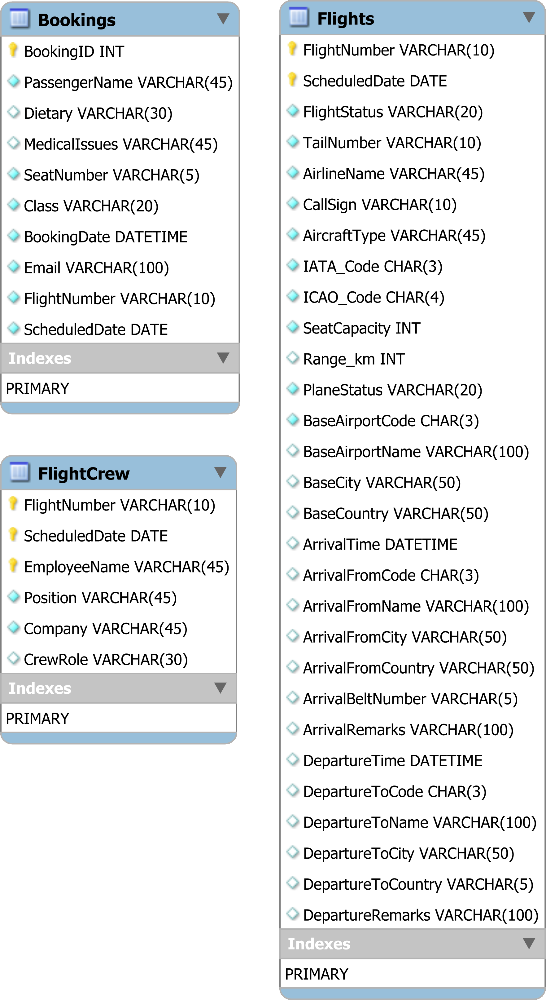
    <div class="text-sm text-gray-600 dark:text-gray-300 mt-1">Figure: ERD before normalisation (1NF stage)</div>
  </div>
  <div class="flex flex-col items-center">
    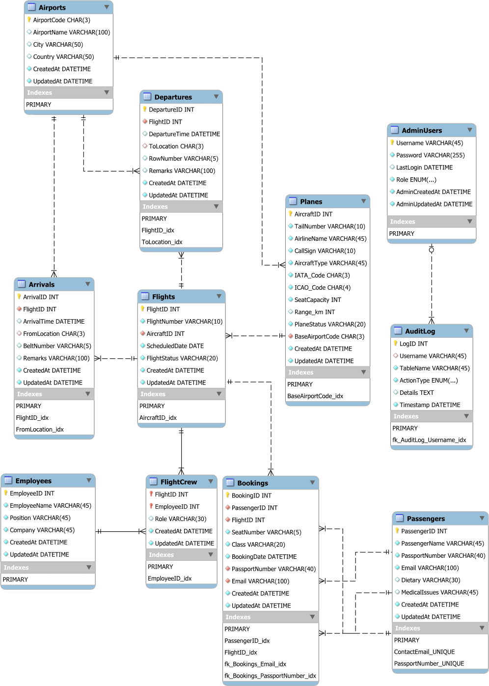
    <div class="text-sm text-gray-600 dark:text-gray-300 mt-1">Figure: Normalised ERD (3NF)</div>
  </div>
</div>

### **Core Entities & Relationships (Logical Schema)**
**Tables (11 total):**  
`Airports, Planes, Flights, Arrivals, Departures, Employees, Passengers, Bookings, FlightCrew, AdminUsers, AuditLog`

**Key relationships implemented via FK constraints (from `database.sql`):**
- **Airports (1) → Planes (M)** via `Planes.BaseAirportCode → Airports.AirportCode`
- **Planes (1) → Flights (M)** via `Flights.AircraftID → Planes.AircraftID`
- **Flights (1) → Arrivals / Departures (M)** via `Arrivals.FlightID`, `Departures.FlightID`
- **Flights (M) ↔ Employees (M)** via junction table **FlightCrew**
  - **Composite PK:** (`FlightID`, `EmployeeID`)
- **Passengers (1) → Bookings (M)** via `Bookings.PassengerID → Passengers.PassengerID`
- **AuditLog** references users with `ON DELETE SET NULL` to preserve logs even after user removal.

---

## **Key Features (with Screenshots)**

### **1) Role-Based Access Control (RBAC)**
- **Front Desk:** view-only access to limited operational tables  
- **Admin:** CRUD on operational tables  
- **Superadmin:** full control, including **AdminUsers** and **AuditLog**

<div class="grid grid-cols-1 sm:grid-cols-2 gap-6 mt-2 mb-6">
  <div class="flex flex-col items-center">
    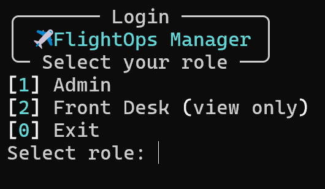
    <div class="text-sm text-gray-600 dark:text-gray-300 mt-1">Role selection + system entry</div>
  </div>
  <div class="flex flex-col items-center">
    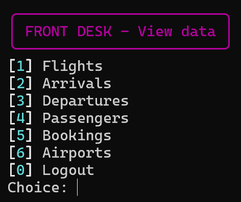
    <div class="text-sm text-gray-600 dark:text-gray-300 mt-1">Front Desk menu (view-only)</div>
  </div>
</div>

<div class="grid grid-cols-1 sm:grid-cols-2 gap-6 mt-2 mb-6">
  <div class="flex flex-col items-center">
    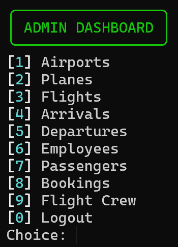
    <div class="text-sm text-gray-600 dark:text-gray-300 mt-1">Admin dashboard (CRUD access)</div>
  </div>
  <div class="flex flex-col items-center">
    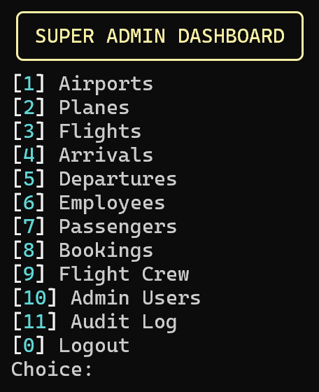
    <div class="text-sm text-gray-600 dark:text-gray-300 mt-1">Superadmin dashboard (AdminUsers + AuditLog)</div>
  </div>
</div>

---

### **2) Schema-Driven CRUD (Dynamic Prompts + Validation)**
The CLI introspects table structure at runtime using:
- `DESCRIBE <table>` for columns + PK detection  
- `information_schema.KEY_COLUMN_USAGE` for FK references  
This enables generic CRUD workflows across many entities without hardcoding forms.

<div class="grid grid-cols-1 sm:grid-cols-2 gap-6 mt-2 mb-6">
  <div class="flex flex-col items-center">
    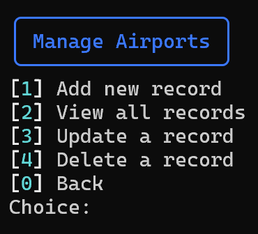
    <div class="text-sm text-gray-600 dark:text-gray-300 mt-1">CRUD menu for an entity (e.g., Airports)</div>
  </div>
  <div class="flex flex-col items-center">
    
    <div class="text-sm text-gray-600 dark:text-gray-300 mt-1">Schema-driven prompts with datatype constraints</div>
  </div>
</div>

<div class="grid grid-cols-1 sm:grid-cols-2 gap-6 mt-2 mb-6">
  <div class="flex flex-col items-center">
    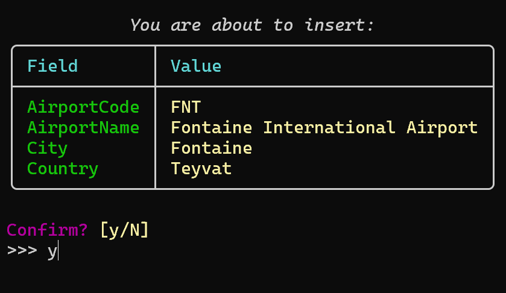
    <div class="text-sm text-gray-600 dark:text-gray-300 mt-1">Insert preview + confirmation before commit</div>
  </div>
  <div class="flex flex-col items-center">
    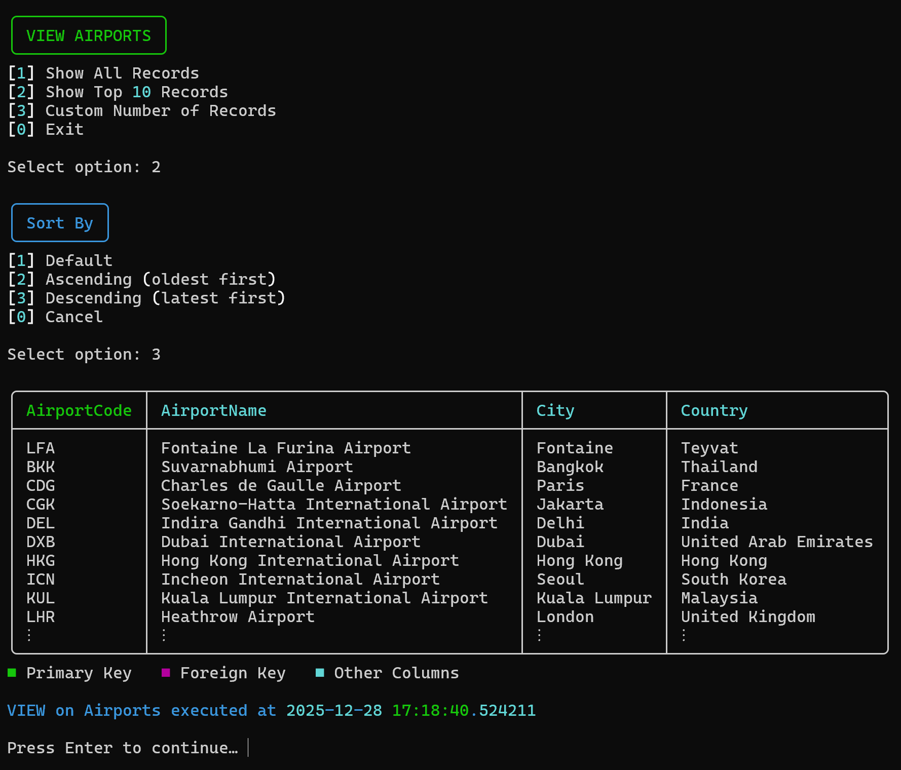
    <div class="text-sm text-gray-600 dark:text-gray-300 mt-1">Rich table output with PK/FK visual legend</div>
  </div>
</div>

---

### **3) Composite Primary Key Handling (FlightCrew)**
For junction tables like **FlightCrew**, the system:
- detects composite PK columns  
- forces user to input the full PK combination  
- validates uniqueness before insert/update

*(Composite PK support is explicitly noted in project specs and implemented in code via PK column detection + uniqueness checks.)*

---

### **4) Sorting / Record Viewing Controls**
Records can be displayed as:
- all rows  
- top 10  
- custom N  
and optionally sorted by the appropriate timestamp column:
- `CreatedAt` for most operational tables  
- `AdminCreatedAt` for AdminUsers  
- `Timestamp` for AuditLog  

<div class="grid grid-cols-1 sm:grid-cols-2 gap-6 mt-2 mb-6">
  <div class="flex flex-col items-center">
    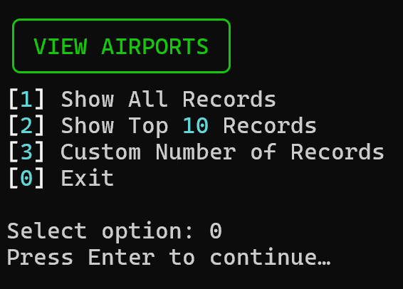
    <div class="text-sm text-gray-600 dark:text-gray-300 mt-1">View mode selection (All / Top 10 / Custom)</div>
  </div>
  <div class="flex flex-col items-center">
    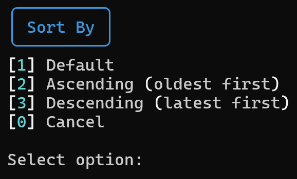
    <div class="text-sm text-gray-600 dark:text-gray-300 mt-1">Sorting options (default / ASC / DESC by timestamp)</div>
  </div>
</div>

---

### **5) Audit Logging (Accountability by Design)**
Every action generates an audit record containing:
- `Username`, `TableName`, `ActionType`, `Details`, `Timestamp`  
AuditLog is viewable only by Superadmin and cannot be modified through normal workflows.

<div class="grid grid-cols-1 sm:grid-cols-2 gap-6 mt-2 mb-6">
  <div class="flex flex-col items-center">
    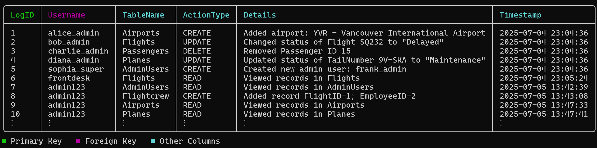
    <div class="text-sm text-gray-600 dark:text-gray-300 mt-1">AuditLog output showing CRUD actions with timestamps</div>
  </div>
  <div class="flex flex-col items-center">
    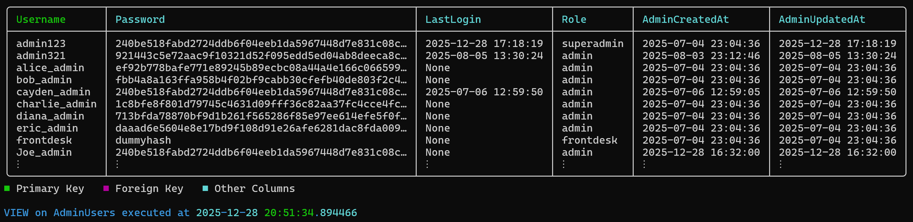
    <div class="text-sm text-gray-600 dark:text-gray-300 mt-1">AdminUsers table (hashed passwords + role column)</div>
  </div>
</div>

---

## **Security & Access Control**
- Admin authentication uses **SHA-256 hashing** (`hashlib.sha256`)  
- **LastLogin timestamp** is updated on successful login  
- Front Desk mode is accessible as a **restricted view-only role**  
- SQL injection is avoided via parameterized queries (`Cursor.execute(SQL, params)`)

---

## **Tech Stack**
- **Language:** Python 3  
- **Database:** MySQL 8.0 (`sg_airport_database`)  
- **Connector:** `mysql-connector-python`  
- **Terminal UI:** `rich` (tables, panels, prompts, styling)  
- **Schema Modelling:** MySQL Workbench (`database.mwb`)  

---

## **My Role**
I designed and implemented the project end-to-end:
- ER modelling and normalization to **3NF**
- Building the MySQL schema with FK constraints and timestamp columns
- Implementing a generic CLI CRUD engine driven by schema introspection
- Implementing composite PK workflows (FlightCrew)
- Audit log architecture + enforcement of privileged access
- UI/UX polish with Rich

---

## **Getting Started**
1. **Prerequisites:** Python 3.8+, MySQL 8.0  
2. **Database Setup:**
   ```bash
   mysql -u root -p < database.sql
   ```

3. **Install Dependencies:**

   ```bash
   pip install mysql-connector-python rich
   ```
4. **Configure Connection:** edit credentials in `startup()` inside `database_cli.py`
5. **Run:**

   ```bash
   python database_cli.py
   ```

---

## **Project Structure**

```text
├── database_cli.py                       # Main CLI application
├── database.sql                          # Schema + sample data
├── database.mwb                          # MySQL Workbench model
└── frames.txt  # ASCII intro frames file (used by intro_sequence())
```

---

## **Outcome**

This project demonstrates strong competency in:

* **Relational DB design:** normalization, referential integrity, junction tables, composite keys
* **Software engineering:** modular CLI design, reusable CRUD engine via schema introspection
* **Security:** hashed credentials + role separation + last login tracking
* **Auditability:** structured logging of operational changes with timestamps + attribution
* **UX polish:** a readable, guided terminal workflow built with Rich
