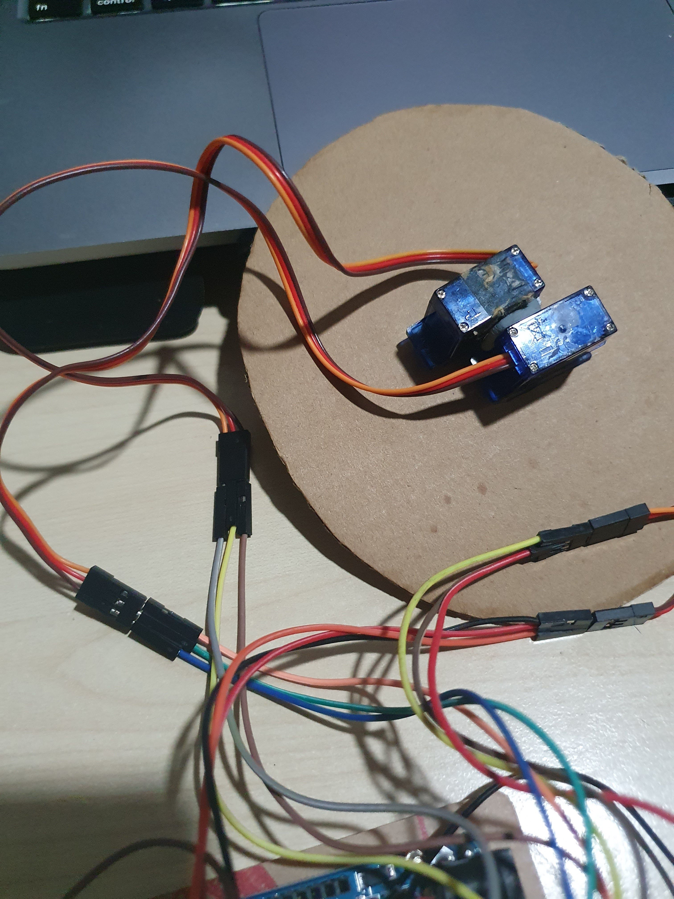

  

<a href="https://github.com/Cayden2606/Morse-Code-Translator" style="display: flex; align-items: center;" target="_blank">
  
  GitHub Repository for Morse Code Translator
</a>

## Overview

This project is an interactive Morse Code Translator that:
1. Lets users input Morse Code using push buttons.
2. Outputs the corresponding text and plays light and sound signals.
3. Utilizes servo motors to indicate letters visually.

This presentation covers:
- Components used
- Project story and background
- Project objective
- System design: sketch, flowchart, and code
- Final product demonstration
- Challenges faced

---

## Components

Here are the main components used in my project:
- 5 resistors
- 4 push buttons
- 7 servo motors
- 1 LED
- 1 buzzer
- 1 breadboard
- 1 Arduino
- Various connecting wires

---

## Project Story and Background

The inspiration for this project came during a visit to the UK, where I explored a World War II museum. I was fascinated by an authentic Morse Code machine and wanted to recreate it with a modern twist. This project allowed me to combine my interest in historical devices with hands-on engineering skills.

---

## Objective

The goal of my project was to design a device that:
1. Allows users to input Morse Code via button presses.
2. Translates the code into text.
3. Provides output through light signals, buzzer sounds, and servo motor movements.

---

## Design and Implementation

### Sketch of the Morse Code Translator

  

Sketch of Morse Code Translator

### Flowchart of the Morse Code Translator

  

Flowchart of Morse Code Translator

### Early Picture

  

Early Picture

## Final Product

After extensive testing and iterations, the Morse Code Translator successfully:
- Converts user input into Morse Code or text.
- Uses servo motors to visually represent letters.
- Provides accurate light and sound feedback.

### Operation:
- **Short click**: Represents a dot (`.`).
- **Long press**: Represents a dash (`-`).
- **Space button**: Differentiates between letters and words.
- **Delete button**: Corrects the last input.
- **Translate button**: Finalizes and translates Morse Code.

---

## Challenges Faced

1. **Troubleshooting the circuit**:
   - Initial wiring issues caused incorrect signals.
2. **Debugging code**:
   - Logic errors in Python led to unexpected results.
3. **Framework unfamiliarity**:
   - Learning the AAD framework was a steep curve.
4. **Servo motor calibration**:
   - Fine-tuning was critical for accurate letter representation.

---

## Closing Remarks

This project was a rewarding experience, allowing me to combine engineering principles with creativity. It provided insight into hardware-software integration and troubleshooting techniques.

Thank you for exploring my project. Feel free to reach out with questions or feedback!

---
