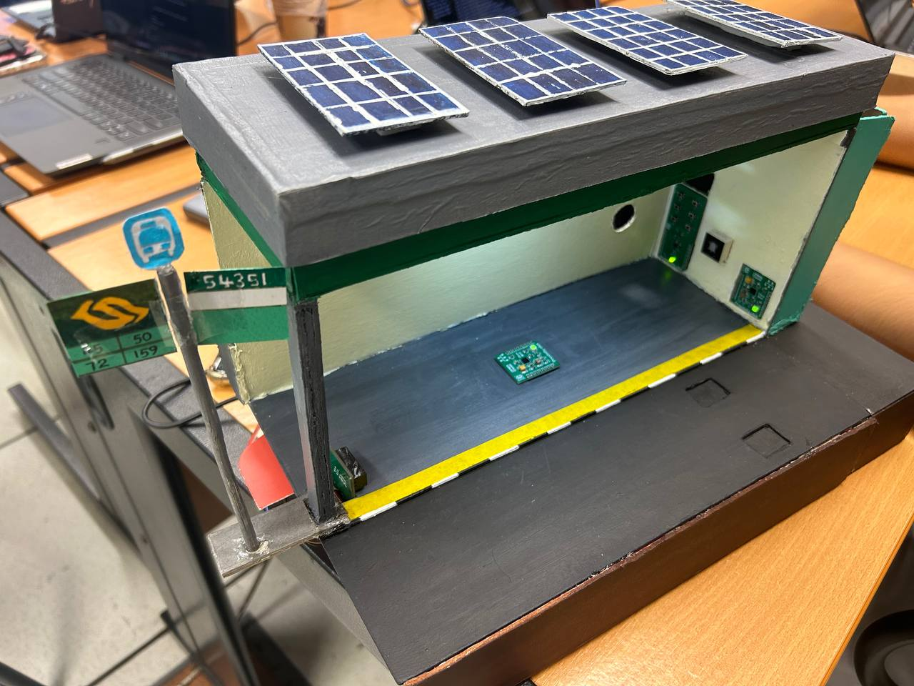
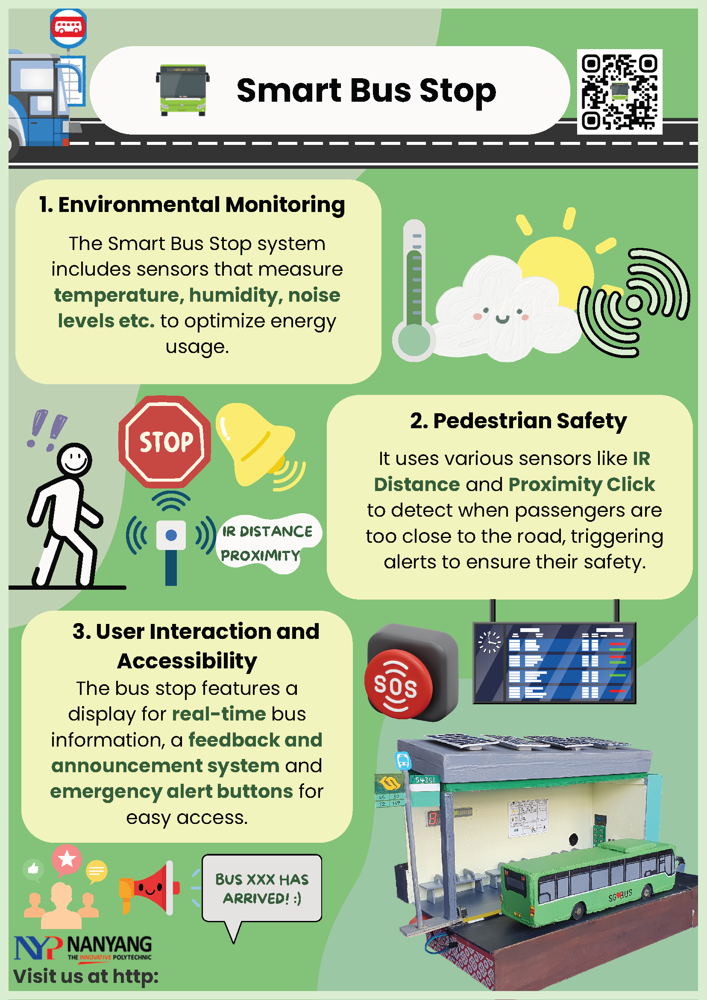
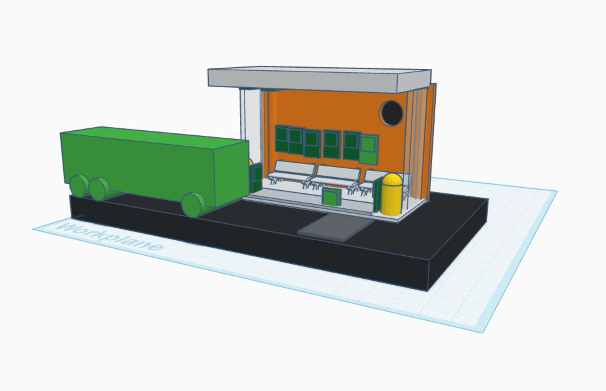
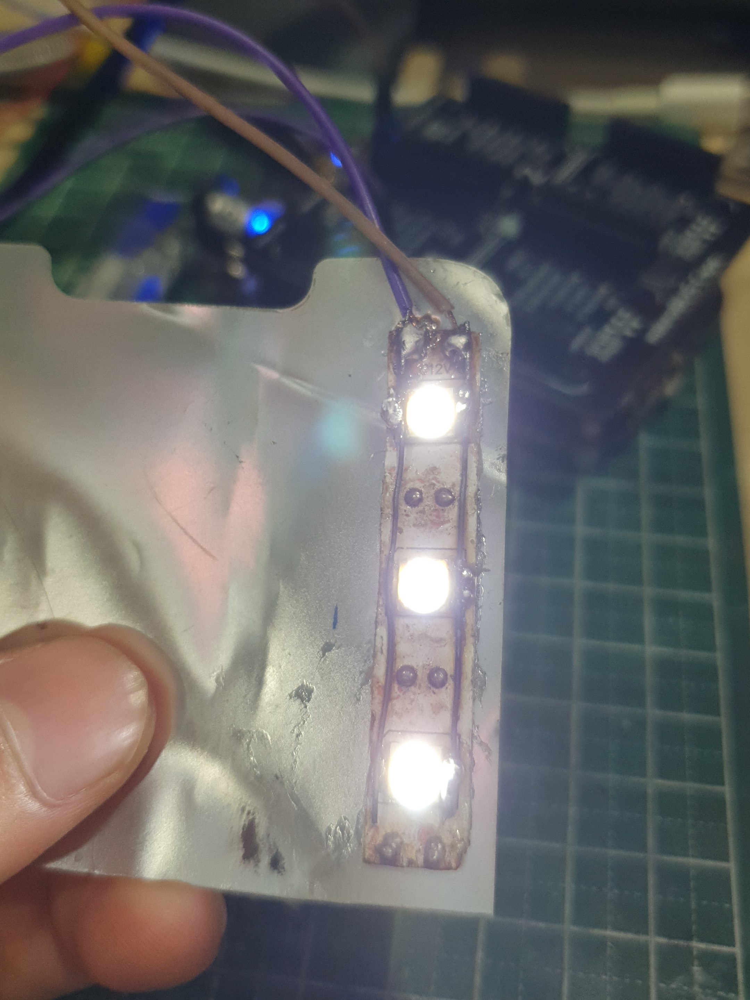
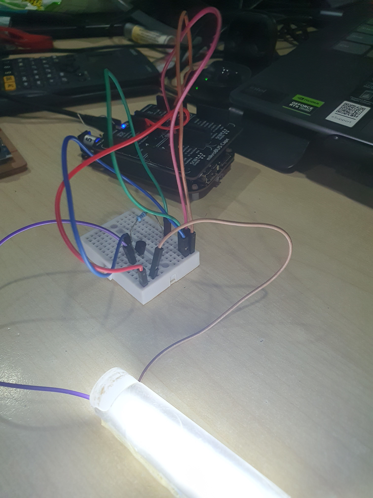
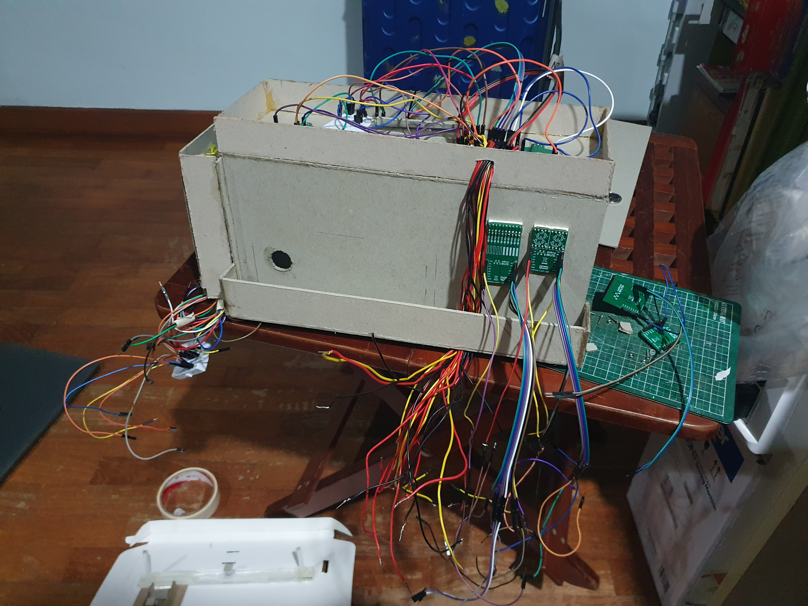
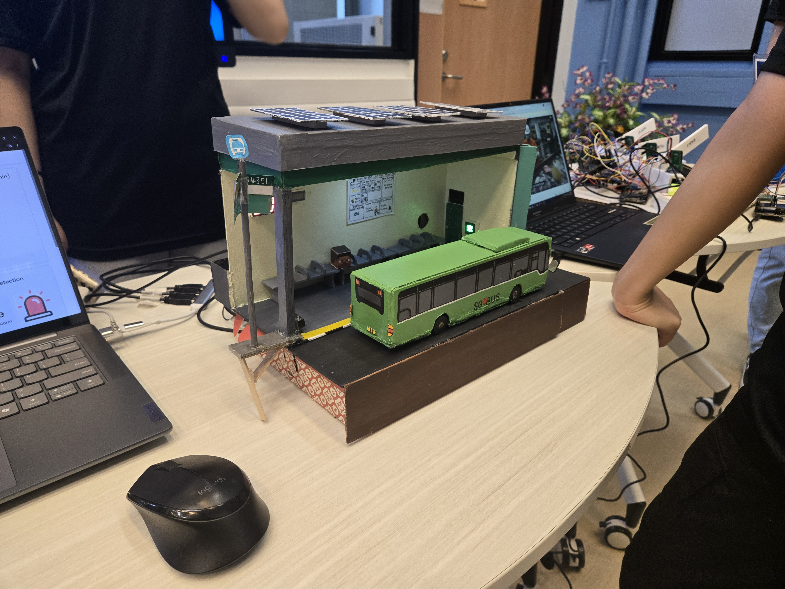



<a href="https://github.com/Cayden2606/Smart-Bus-Stop" style="display: flex; align-items: center;" target="_blank">
  
  GitHub Repository for Smart Bus Stop
</a>

<!-- ## Story

Public transportation is vital to sustainable cities but faces challenges like unreliable schedules, weather exposure, and limited real-time updates. The **Smart Bus Stop** combines IoT, renewable energy, and user-focused design to overcome these issues, modernising transit infrastructure.

## Objectives

- **Real-Time Information**: Equip commuters with live bus tracking and arrival updates.
- **Sustainability**: Use solar energy for powering lights, displays, and utilities.
- **Enhanced User Experience**: Include interactive, weatherproof screens and ergonomic seating.

## Research Insights

- **Real-Time Updates**: 75% of commuters prefer live transit data for better journey planning.
- **Eco-Friendly Design**: Solar-powered systems reduce carbon footprints and costs.
- **Accessibility**: Voice support and braille features ensure inclusivity for all users.

## Project Overview

  
  
Smart Bus Stop Prototype

## Key Features:

1. **Real-Time Tracking**: Displays bus locations and arrival times using GPS and cloud integration.
2. **Solar Power**: Provides sustainable energy for lighting, displays, and charging ports.
3. **Interactive Displays**: Offers route information, nearby services, and emergency contacts.
4. **Passenger Comfort**: Includes weatherproof shelters, ergonomic seating, and USB charging.
5. **Accessibility**: Voice-enabled announcements and braille support for differently-abled users.

## Video Demonstration  


## Presentation Slides
<iframe src="https://docs.google.com/presentation/d/e/2PACX-1vQpztXXnkCvELb5wkHIPZOLc66UXb9YU94gcP-CCiEdJXxIL-WexqyYuXI0xBXN_4dLi2h4tWSFRWtJ/embed?start=false&loop=false&delayms=3000" frameborder="0" width="100%" height="500px" allowfullscreen="true" mozallowfullscreen="true" webkitallowfullscreen="true"></iframe>

## Poster

  

## Planning Stages

  

    
    
Tinkercad Design

  

  

    <video autoplay loop muted style="max-width: 100%; height: auto;">
      <source src="Media/busmodel.mp4" type="video/mp4">
      Your browser does not support the video tag.
    </video>
    
Design Overview

  

  

    <video autoplay loop muted style="max-width: 100%; height: auto;">
      <source src="Media/BBBWs.mp4" type="video/mp4">
      Your browser does not support the video tag.
    </video>
    
BeagleBone Black Wireless with clicks

  

## Lighting System

- **Modified LED Strip**: Uses recycled light filters from a Huawei Nova 3i screen.
- **PWM Control**: Adjusts brightness dynamically via a BJT amplifier circuit.

  

    
    
Modified LED Strip

  

  

    
    
BJT Amplifier Circuit

  

  

    <video autoplay loop muted style="max-width: 100%; height: auto;">
      <source src="Media/PWM.mp4" type="video/mp4">
      Your browser does not support the video tag.
    </video>
    
PWM Demostration

  

    

    <video autoplay loop muted style="max-width: 100%; height: auto;">
      <source src="Media/PWM2.mp4" type="video/mp4">
      Your browser does not support the video tag.
    </video>
    
PWM Demostration

  

## Wiring and System Integration

The wiring system connects the LED strip, PWM controller, BJT amplifier and other Clicks for seamless operation.

  

-->

## **Project Scope**
Public transportation is vital to sustainable cities but faces challenges such as unreliable schedules, weather exposure, and limited real-time updates. This project aims to modernise transit infrastructure by integrating IoT, renewable energy, and user-focused design.

The **Smart Bus Stop** addresses these challenges by:
- Providing **real-time information** to improve commuter experience.
- Promoting **sustainability** through solar-powered systems.
- Enhancing **user experience** with accessible and ergonomic designs.
  

    
    
Smart Bus Stop Prototype

  

---
## **Video Demonstration**


---

## **My Role**
As the team leader for this project, I guided a group of four in transforming the vision of an IoT Smart Bus Stop into reality. I distributed tasks effectively, ensuring that each team member contributed to their strengths. I led the design and development process, coding most of the system and overseeing the execution of key features. Additionally, I supported my peers in creating the real-life mock-up, designing the poster, recording and editing the video, and preparing the presentation slides, fostering a collaborative and productive team environment.
<!-- - Designing the **system architecture** to integrate IoT components, solar power, and user-centric features.
- Conducting **research** to align the design with commuter needs and environmental sustainability.
- Developing the **lighting system** with modified LED strips and a PWM-controlled brightness system.
- Overseeing the **prototyping process**, including wiring and system integration. -->
---

## **Work Process**

### **Research and Design**
- Conducted surveys to understand commuter preferences, revealing that **75% of users prefer real-time transit updates**.
- Studied eco-friendly systems to develop **solar-powered designs**, reducing the carbon footprint.

### **Prototyping and Development**
- Designed the system in **Tinkercad** for early visualisations.
  

    
    
Tinkercad Design

  

- Designed bus stop integration using **Spline** for planning.
    

    <video autoplay loop muted style="max-width: 100%; height: auto;">
      <source src="Media/busmodel.mp4" type="video/mp4">
      Your browser does not support the video tag.
    </video>
    
Bus Stop Integration Design

  

- Integrated **BeagleBone Black Wireless** for IoT functionalities and cloud integration.
  

    <video autoplay loop muted style="max-width: 100%; height: auto;">
      <source src="Media/BBBWs.mp4" type="video/mp4">
      Your browser does not support the video tag.
    </video>
    
BeagleBone Black Wireless Integration

  

### **Lighting System Development**
- Used recycled materials to create a **modified LED strip** with **PWM brightness control** via a BJT amplifier circuit.
  

    

      
      
Modified LED Strip

    

    

      
      
BJT Amplifier Circuit

    

    

      <video autoplay loop muted style="max-width: 100%; height: auto;">
        <source src="Media/PWM.mp4" type="video/mp4">
        Your browser does not support the video tag.
      </video>
      
PWM Demonstration

    

    

      <video autoplay loop muted style="max-width: 100%; height: auto;">
        <source src="Media/PWM2.mp4" type="video/mp4">
        Your browser does not support the video tag.
      </video>
      
PWM Demonstration

    

  

### **System Integration**
- Connected LED strips, PWM controllers, and IoT components to complete the system wiring.
  

    
    
Wiring Diagram

  

---

## **Outcome Achieved**
The Smart Bus Stop successfully demonstrates:
- **Real-Time Information**: GPS and cloud integration for live bus tracking and arrival updates.
- **Sustainability**: Solar-powered systems reduce operational costs and carbon emissions.
- **Enhanced User Experience**: Ergonomic seating, USB charging, and accessible features like braille and voice-enabled announcements.

#### **Technexus 2025**

    

      
      
Technexus 2025

    

    

      
      
Technexus 2025

    

- Nominated and showcased at **Technexus 2025**, a prestigious academic project event.
- **2nd place** overall and **1st place** as Most Popular, voted by students and attendees, showcasing creativity, technical expertise, and practical applicability.

**Presentation Slides**:
  <iframe src="https://docs.google.com/presentation/d/e/2PACX-1vQpztXXnkCvELb5wkHIPZOLc66UXb9YU94gcP-CCiEdJXxIL-WexqyYuXI0xBXN_4dLi2h4tWSFRWtJ/embed?start=false&loop=false&delayms=3000" frameborder="0" width="100%" height="500px" allowfullscreen="true" mozallowfullscreen="true" webkitallowfullscreen="true"></iframe>

**Poster**:
  

    
  
