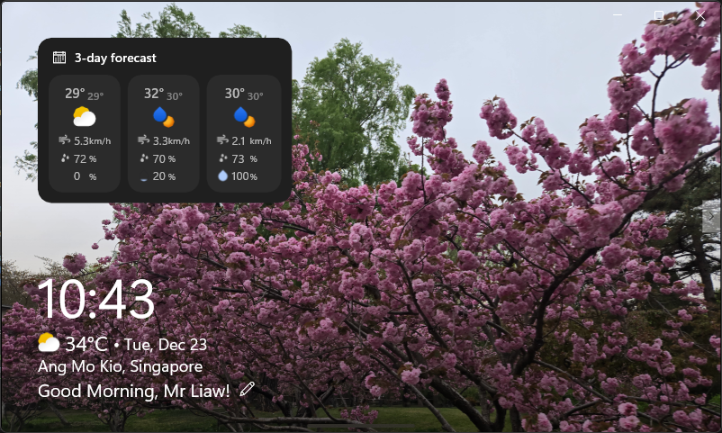
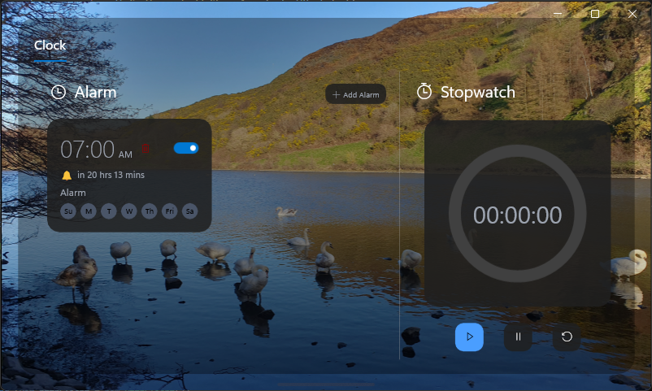
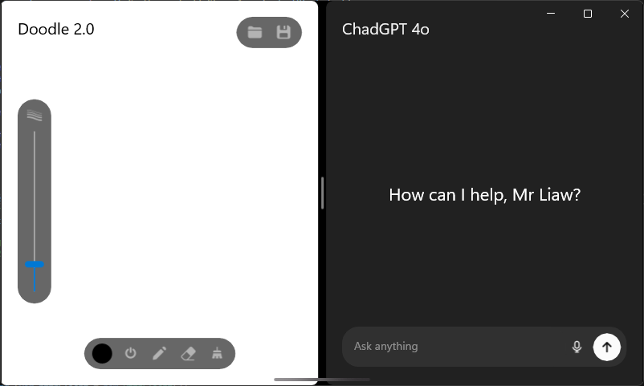
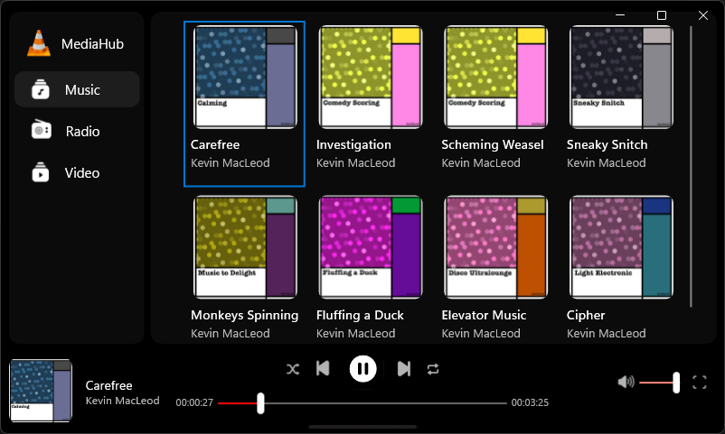
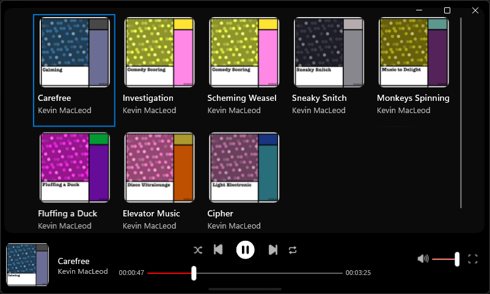
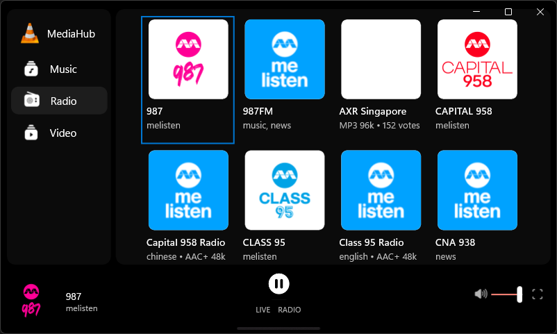
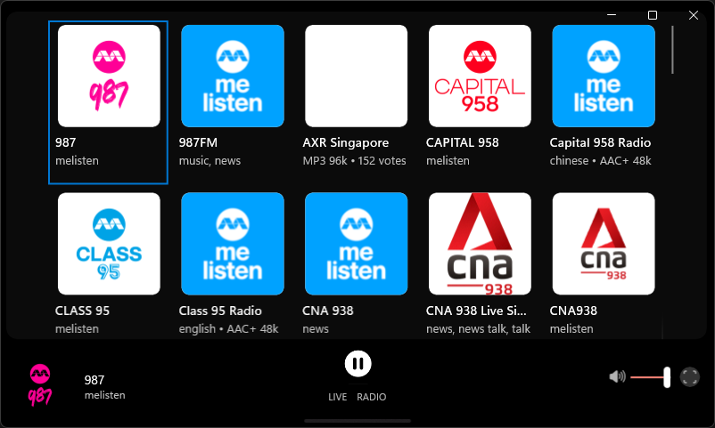
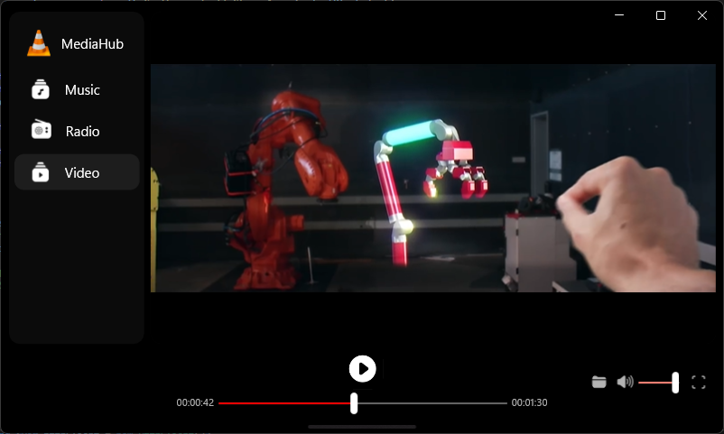
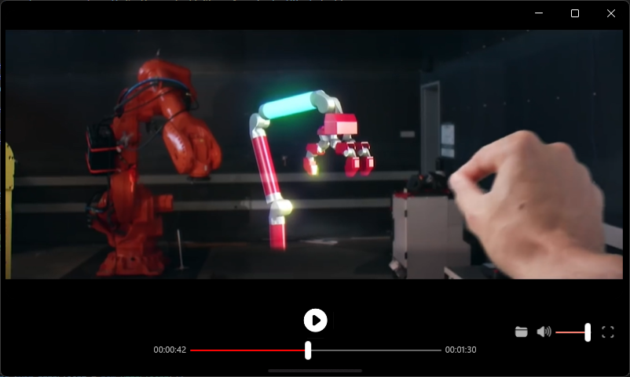



<a href="https://github.com/Cayden2606/Vantage-Hub" style="display:flex;align-items:center;gap:10px;" target="_blank" rel="noopener">
  
  GitHub Repository
</a>

---

## **Overview**
**Vantage Hub** is a multi-functional Windows UWP desktop application designed to serve as a personal smart hub. It combines essential daily utilities—weather forecasting, alarm management, media playback, AI-assisted chat, and digital sketching—into a unified, modern interface optimised for both touch and desktop interaction.

> **📚 Academic Project**  
> This project was developed as part of **EGE350 - Application Development & Cloud Services**.

---

## **Screenshots** 📸

### Home Dashboard

### Alarm Management

### App Switcher

### Sketching & AI Chatbot

### Media Hub - Music Player

  
  

### Media Hub - Radio

  
  

### Media Hub - Video Player

  
  

---

## **Problem**
Users often juggle multiple standalone apps for weather, alarms, music, and productivity tools, resulting in a fragmented desktop experience. Vantage Hub consolidates these core features into a single cohesive application that provides quick access to everyday utilities, reducing cognitive load and improving workflow efficiency.

---

## **Key Features**

### **🏠 Home Dashboard**
- **Real-time Weather** — 5-day forecast with dynamic weather icons, temperature, humidity, wind speed, and precipitation probability using [OpenWeatherMap API](https://openweathermap.org/api)
- **Real-time Clock** — Day/date/time with time-aware greeting (Morning / Afternoon / Evening / Night)
- **Customizable Greetings** — Personalize your dashboard greeting message
- **Touch-first Interactions** — Drag + transform support via manipulation handlers

### **⏰ Alarm & Stopwatch**
- **Smart Alarm System** — Create, edit, and manage alarms with:
  - Repeating days (weekday selection)
  - Custom alarm sounds (6 built-in tones)
  - Visual time-remaining countdown
  - One-time alarms (auto-disabled after expiry)
- **Stopwatch** — Precision timer with start/pause/reset controls
- **JSON Persistence** — Alarms and preferences saved locally

### **🎵 Media Hub**
- **Local Music Player** — Built-in music library with album art
  - Play/Pause, Next/Previous track controls
  - Shuffle (Fisher-Yates algorithm) and Loop modes
  - Volume control with mute toggle
  - Progress bar with seek functionality
  - 🎶 *All included music is royalty-free by [Kevin MacLeod](https://incompetech.com/)*
- **Live Radio Streaming** — Browse and play Singapore radio stations via [Radio Browser API](https://www.radio-browser.info/)
  - Auto-filtered for working stations with valid cover art
  - Metadata display (codec, bitrate, votes)
- **Video Player** — Play local video files (mp4, mkv) with fullscreen mode and file picker support

### **🎨 Doodle + AI Chat**
- **Digital Canvas** — InkCanvas-based drawing with:
  - Pen/Eraser tools with pressure support (stylus)
  - Color picker and adjustable brush size
  - Load background images for tracing
  - Save drawings as PNG
- **AI Chatbot** — Powered by [Google Gemini API](https://ai.google.dev/)
  - Text-to-Speech (TTS) for responses
  - Copy response to clipboard
- **Speech Recognition** — Voice input for chat using Windows Speech API
- **Hover-to-Reveal Layout Swap** — Switch button to swap Doodle and Chat panels

### **🔄 App Switcher**
- **Keyboard:** `Ctrl + Space` opens the app switcher; while holding `Ctrl`, press `Space` to cycle; releasing selects (Alt+Tab style)
- **Gesture:** Swipe up from the bottom interaction zone to open the app switcher (touch-friendly)
- **Acrylic UI Effects** — Modern Windows Fluent Design styling

---

## **Tech Stack**

| Category | Technologies |
|----------|--------------|
| **Framework** | UWP (Universal Windows Platform) |
| **Language** | C# |
| **UI** | XAML, Fluent Design System, Acrylic Effects |
| **Weather API** | [OpenWeatherMap](https://openweathermap.org/api) (5-day forecast) |
| **AI Integration** | [Google Gemini](https://ai.google.dev/) (generative AI) |
| **Radio API** | [Radio Browser](https://www.radio-browser.info/) |
| **Speech** | Windows.Media.SpeechRecognition, SpeechSynthesis |
| **Inking** | Windows.UI.Input.Inking (InkCanvas) |
| **Serialisation** | Newtonsoft.Json |
| **Platform** | Windows 10/11 (SDK 10.0.22621.0) |

---

## **API Keys & Services**

This project uses external APIs that require authentication:

| Service | Purpose | Get API Key |
|---------|---------|-------------|
| **OpenWeatherMap** | Weather forecasts | [openweathermap.org](https://openweathermap.org/api) |
| **Google Gemini** | AI chatbot | [ai.google.dev](https://ai.google.dev/) |
| **Radio Browser** | Radio stations | *No key required* |

### **Setting Up API Keys**
1. Copy `secrets.template.json` to `secrets.json` in the project root
2. Add your API keys to the JSON file
3. **Note:** `secrets.json` is excluded from Git via `.gitignore` to keep keys private

---

## **My Role**
Sole developer responsible for:
- End-to-end UWP application architecture and UI/UX design
- Integration of external APIs (weather, radio, generative AI)
- Implementation of alarms (recurring + one-time), sound playback, and stopwatch utilities
- MediaHub development (music library, radio streaming, video playback)
- InkCanvas drawing tools + export pipeline
- Accessibility-focused features (speech-to-text + text-to-speech)
- Persistent storage for alarms and user preferences

---

## **Project Structure**

| Folder/File | Description |
|------------|-------------|
| `App.xaml(.cs)` | Application entry point |
| `MainPage.xaml(.cs)` | Home dashboard, weather, greetings, alarms, and stopwatch module |
| `Music.xaml(.cs)` | MediaHub: music library + player, radio station browser, video playback |
| `Sketching.xaml(.cs)` | InkCanvas doodle tools + AI chatbot (speech + TTS) + panel swap |
| `OpenWeatherMap.cs` | Weather API integration + data models |
| `radio-API.cs` | Radio station retrieval + streaming metadata client |
| `SecretsManager.cs` | API key management |
| `secrets.json` | Your API keys (not in Git) |
| `secrets.template.json` | Template for secrets.json |
| `audio/` | Music & alarm sound files |
| `musicart/` | Album cover images |
| `weather_icons/` | SVG weather icons |
| `icons/` | UI icons for controls and navigation |
| `video/` | Sample video content |

---

## **Quick Start (User Controls)**
- **Switch apps:** `Ctrl + Space` (hold Ctrl, tap Space to cycle, release to select)
- **Touch switcher:** Swipe up from the bottom zone to open the app switcher
- **Doodle/Chat layout:** Hover to reveal the switch button, then tap to swap panels

---

## **Permissions Required**

The app requires the following capabilities (configured in `Package.appxmanifest`):
- **Location** — For weather based on current location
- **Microphone** — For speech recognition
- **Internet** — For API calls and radio streaming

---

## **Outcome**
This project demonstrates proficiency in:
- **UWP Development:** Building a polished multi-page Windows application with touch-first UX
- **API Integration:** Consuming live data sources for weather, radio, and AI features
- **Multi-feature Architecture:** Coordinating alarms, media playback, AI chat, and inking within a cohesive UI
- **Accessibility:** Speech-to-text and text-to-speech for inclusive interaction
- **State Management:** Persistent storage, timers, and async flows across multiple modules
